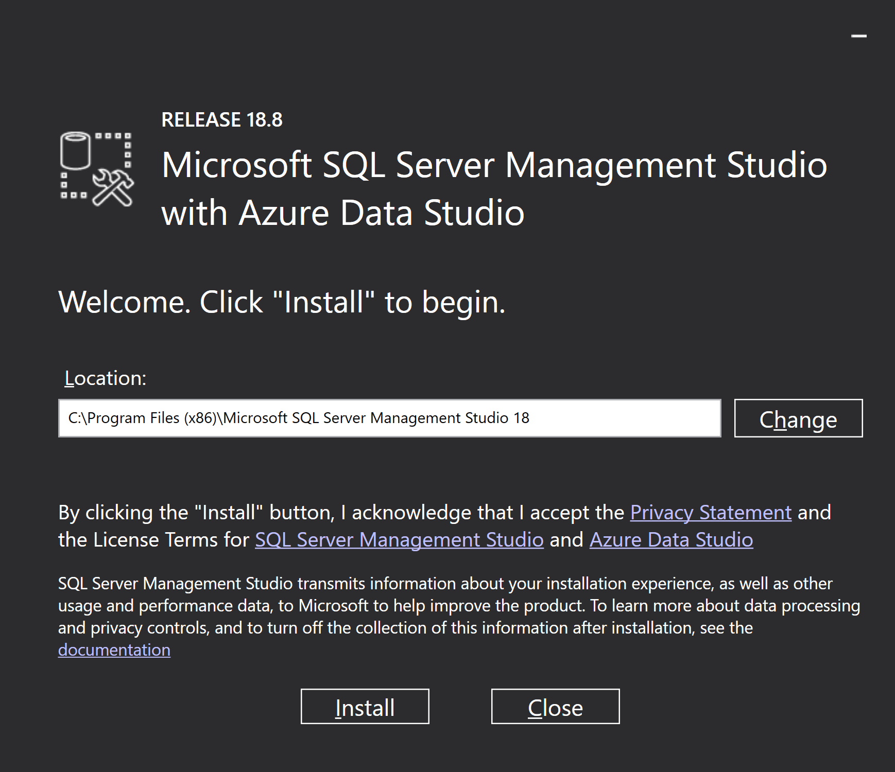
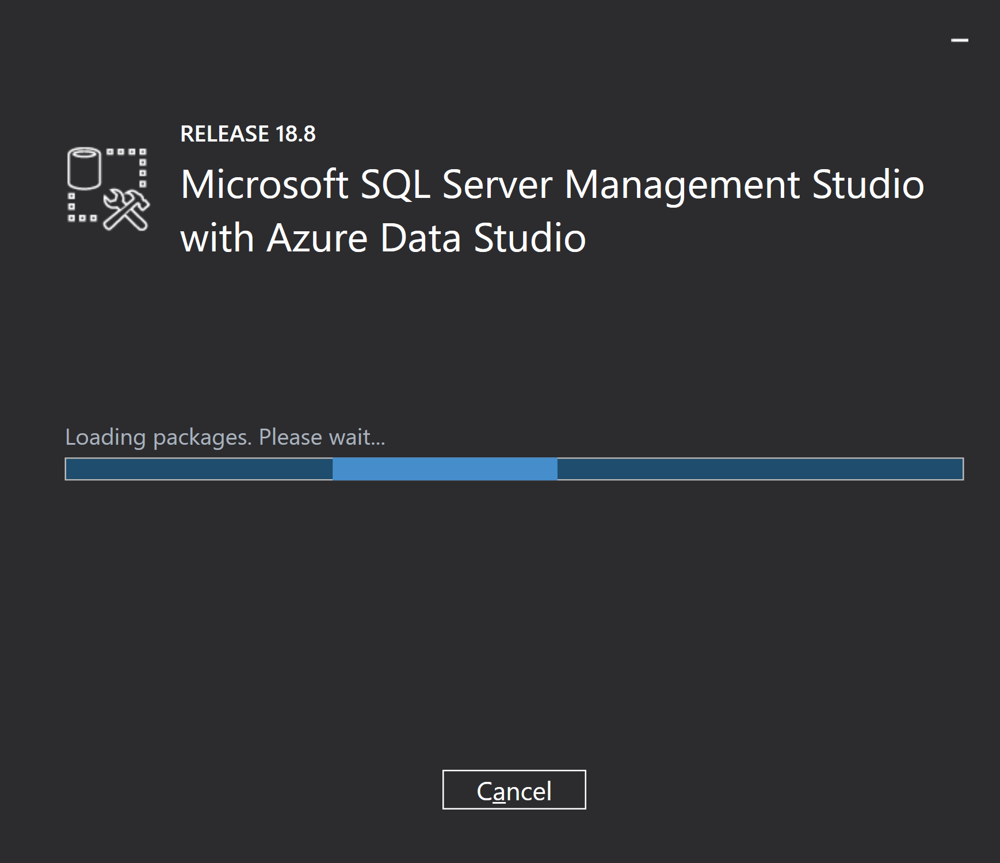
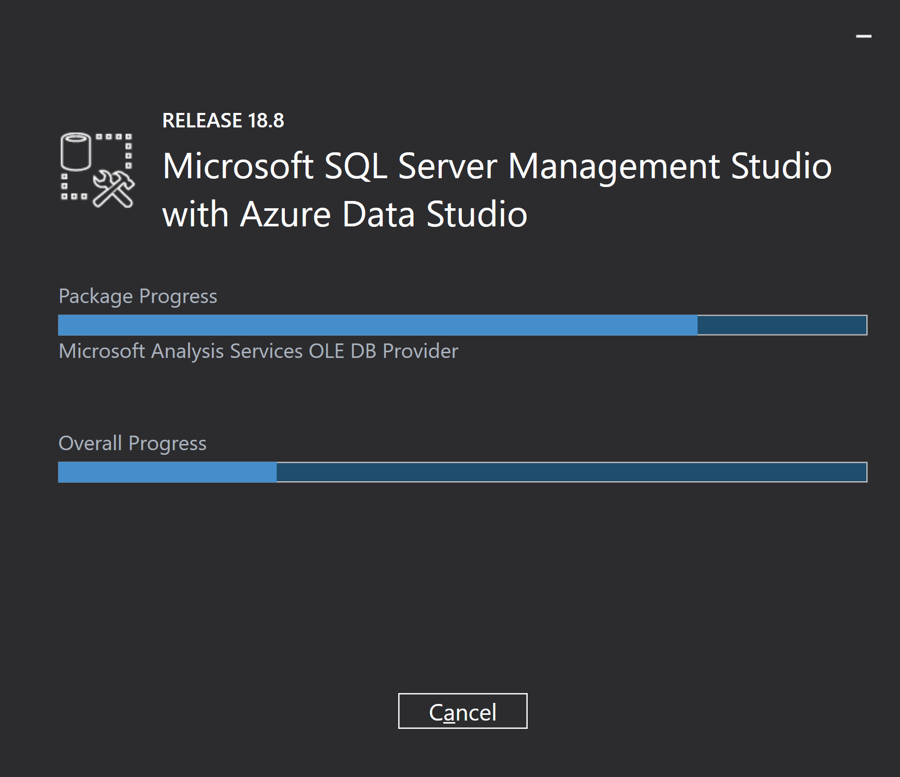
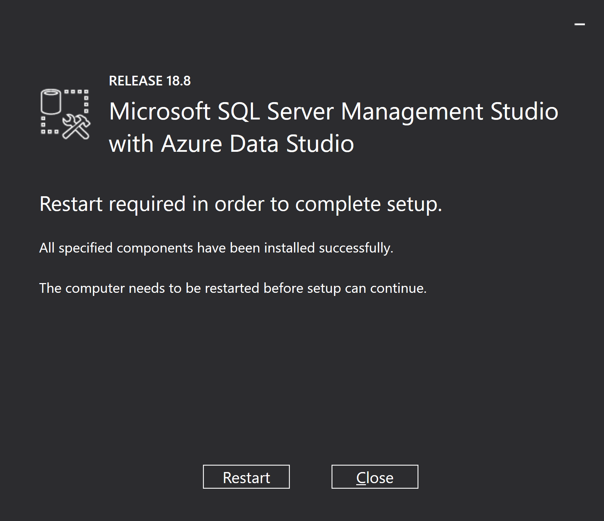
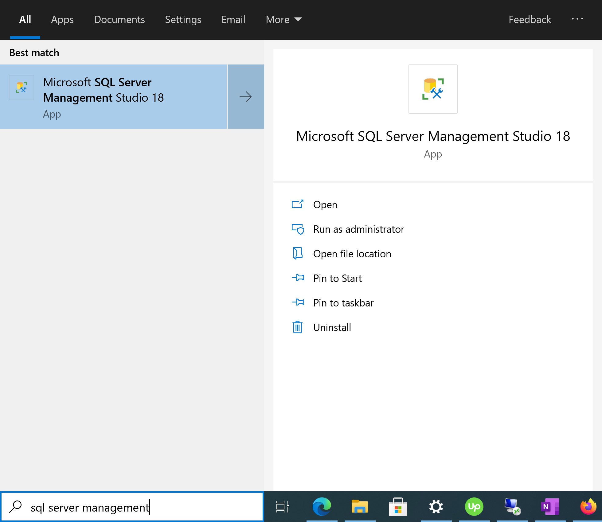
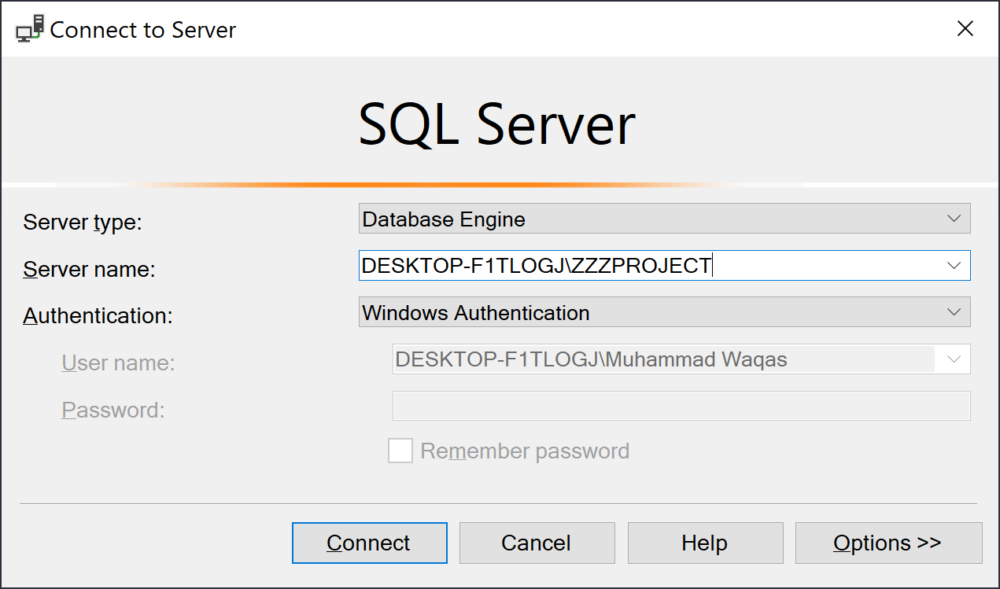
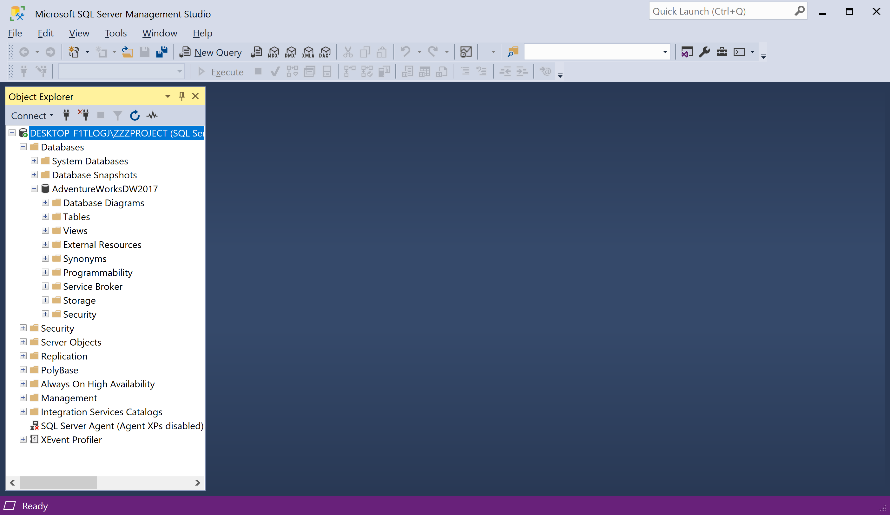

# Environment Setup

SQL Server Management Studio 18.8 is the latest general availability (GA) version of SSMS. If you have a previous GA version of SSMS 18 installed, installing SSMS 18.8 upgrades it to 18.8.

 - Beginning with SQL Server Management Studio (SSMS) 18.7, Azure Data Studio is automatically installed alongside SSMS. 
 - Users of SQL Server Management Studio are now able to benefit from the innovations and features in Azure Data Studio. 
 - Azure Data Studio is a cross-platform and open-source desktop tool for your environments, whether in the cloud, on-premises, or hybrid.

You can download the latest version of the SSMS from the [Microsoft download website](https://docs.microsoft.com/en-us/sql/ssms/download-sql-server-management-studio-ssms?view=sql-server-ver15). After downloading the setup file, open the setup file as Administrator.

On this page, the **Location** setting specifies the installation path of the Microsoft SQL Server Management Studio and, you can also change the location and then click the **Install** button.

Once the package load is complete, the installation will be initiated by setup automatically.

You can see now that 2 progress bars, one is for package-specific progress and the other is for the overall progress of this installation.

SQL Server Management Studio has been installed successfully and the installation requires a restart of the machine. Click the **Restart** button to complete this installation.

Go to the start menu and search "sql server management studio".

You can see **Microsoft SQL Server Management Studio 18**, select it and you will see the **Connect to Server** dialog, enter the SQL Server instance details

Click on the **Connect** button and you can see that the database connection has been established with the SQL Server 2019.

