# Export Data

SQL Server Management Studio (SSMS) provides the Export Wizard task, which you can use to copy data from one data source to another. Let's open SQL Server Management Studio and connect to the database. 

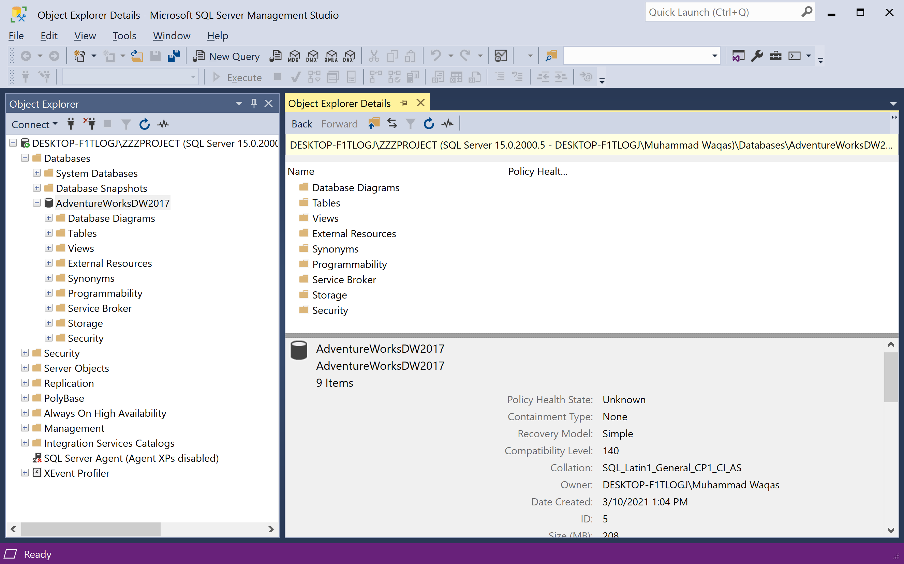

Go to the **Object Explorer**, right-click on the database you want to export to Excel, and choose **Tasks > Export Data** to export table data in SQL.

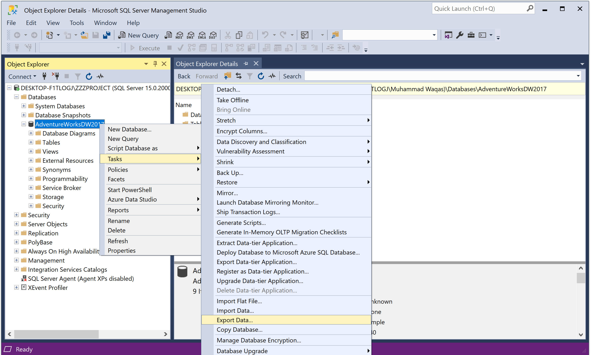 Export Data">

It will open **SQL Server Import Export Wizard** dialog.

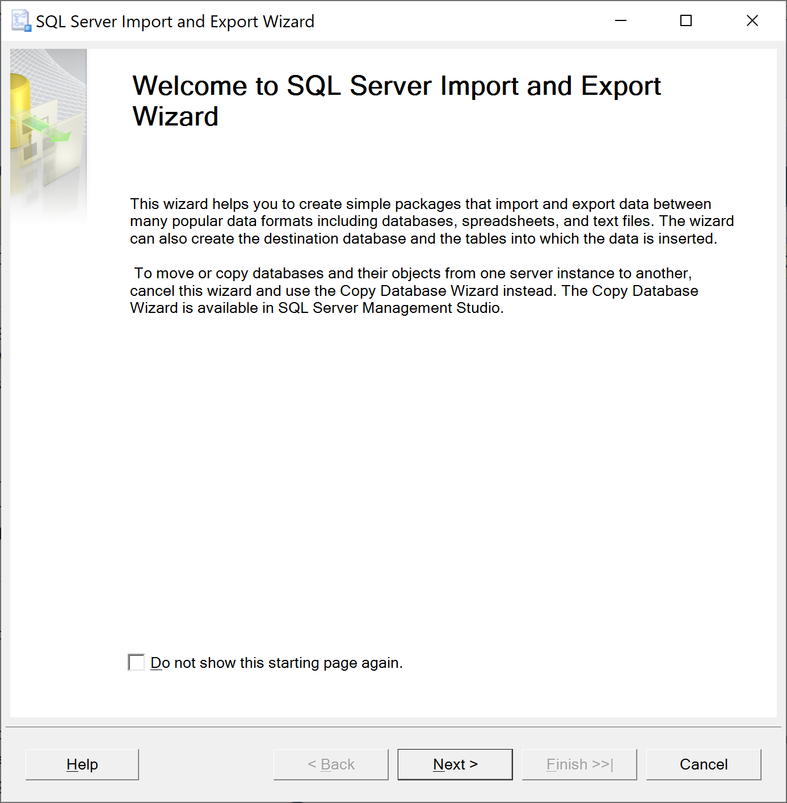

Click the **Next** button, and you need to click on the **Data source** drop-down to choose the data source.

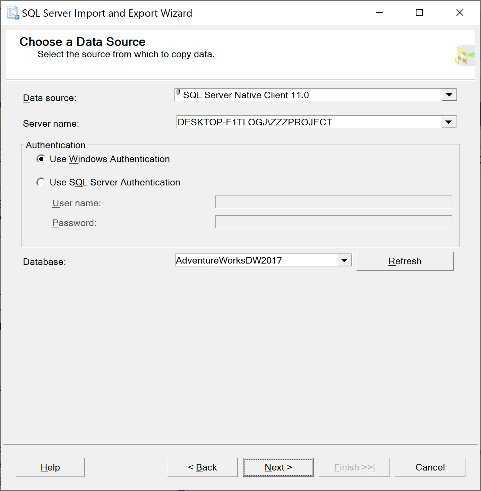

 - Select **SQL Server Native Client 11.0** as a data source. 
 - In the **Server name** drop-down, select a SQL Server instance. 
 - In the **Authentication** section, choose **Use Windows Authentication** for the data source connection.
 - From the **Database** drop-down, select a database from which data will be exported.

After everything is set, click the **Next** button. 

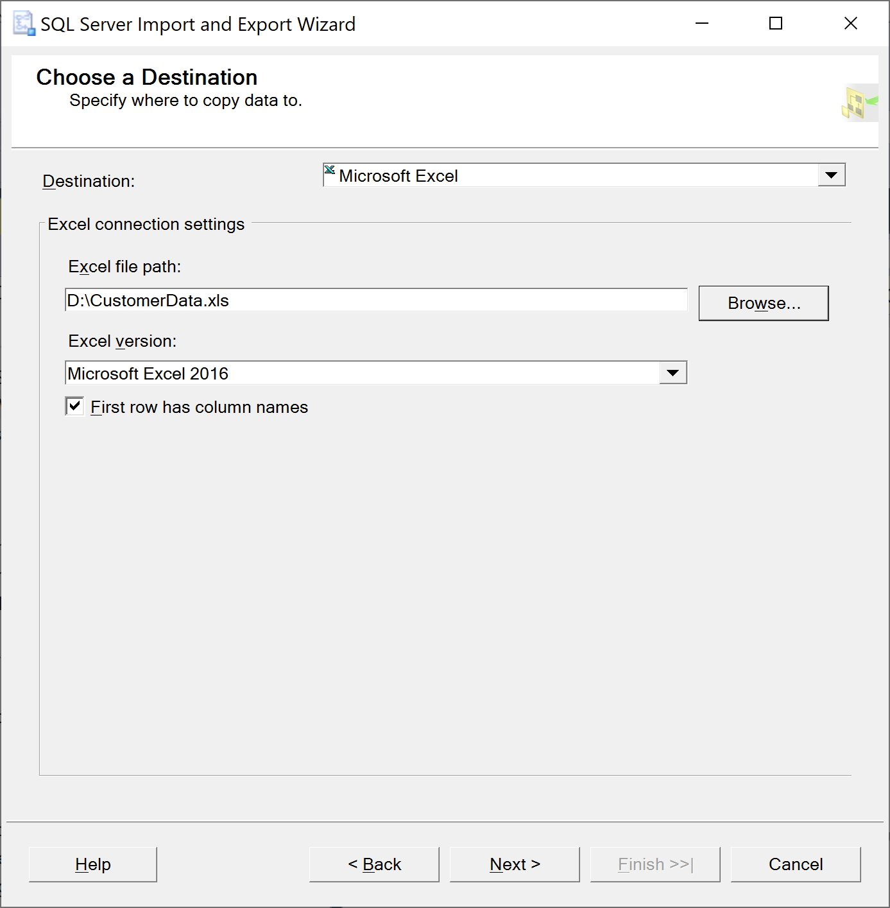

On the **Choose a Destination** dialog, choose **Microsoft Excel** from the **Destination** drop-down. You will also need to choose the Excel file path and version as you need and then click the **Next** button.

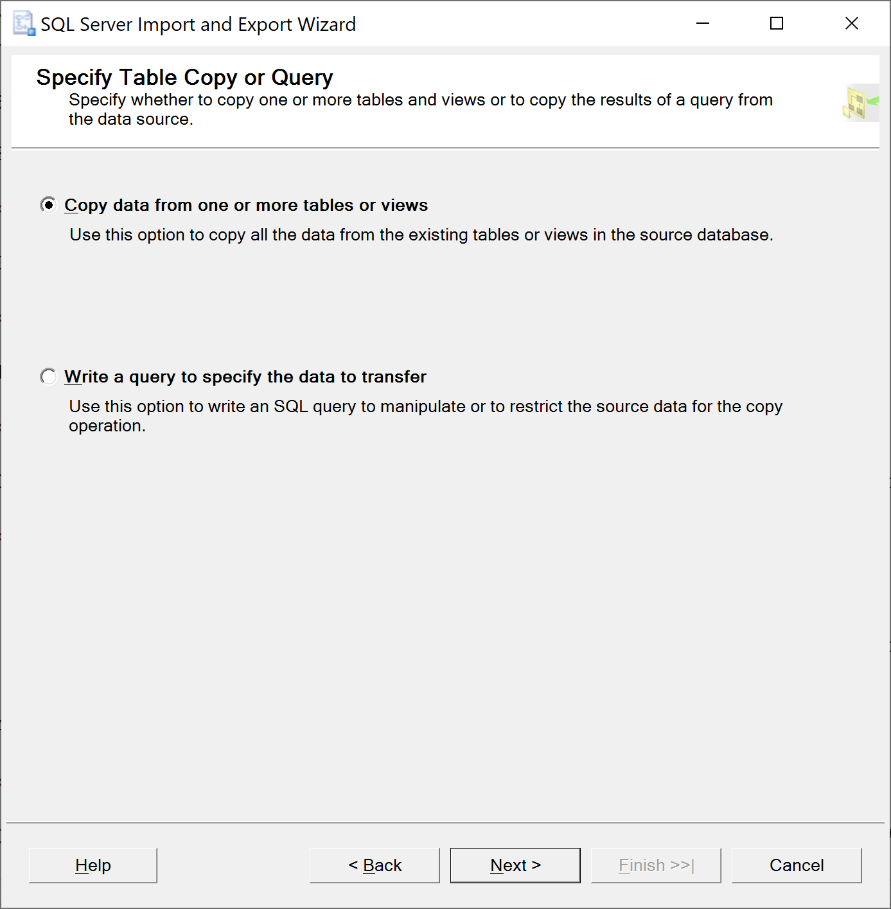

On the **Specify Table Copy or Query** dialog, select **Copy data from one or more tables or views** and then click the **Next** button.

In the **Select Source Table and Views** window, you can choose one or more tables and views from which you want to export SQL Server data to Excel. Let's select the `DimCustomer` and click the **Preview** button to preview which data will be generated to an Excel file. 

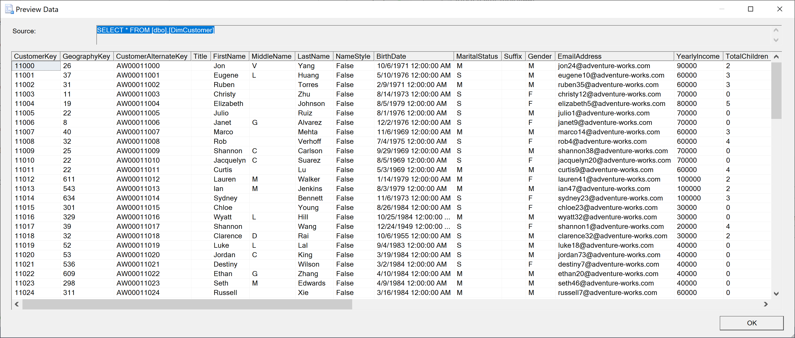

Click the **OK** and then click the **Next** button.

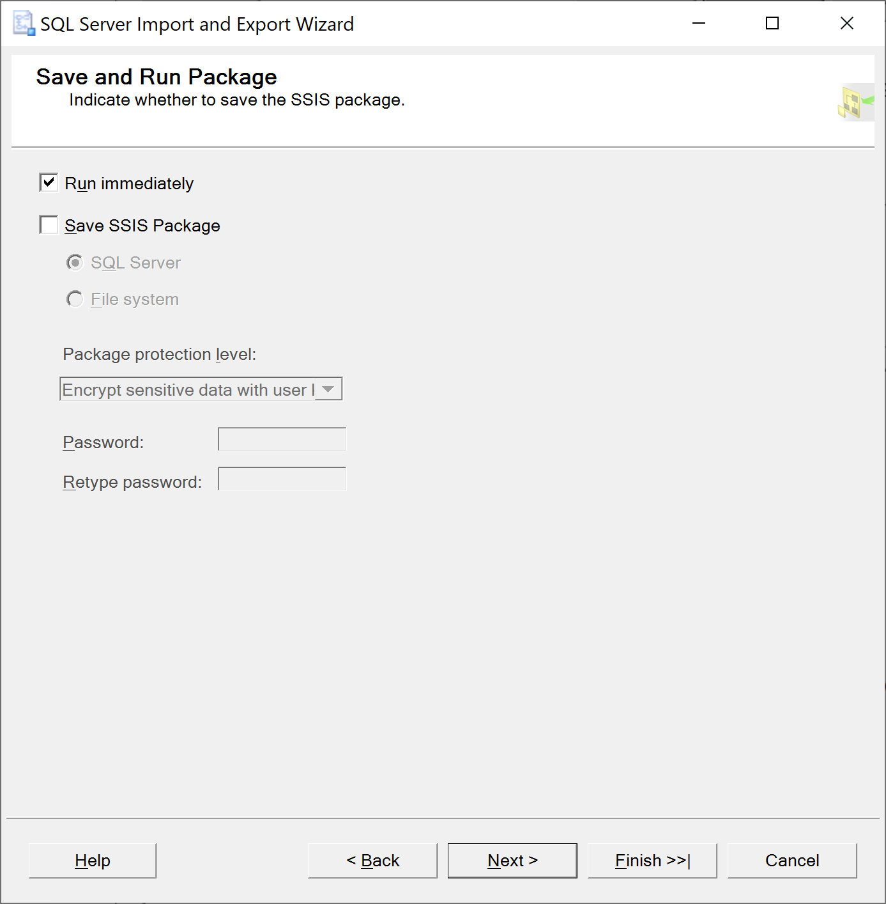 

On the **Save and Run Package** dialog, select the **Run immediately** and then click the **Next** button.

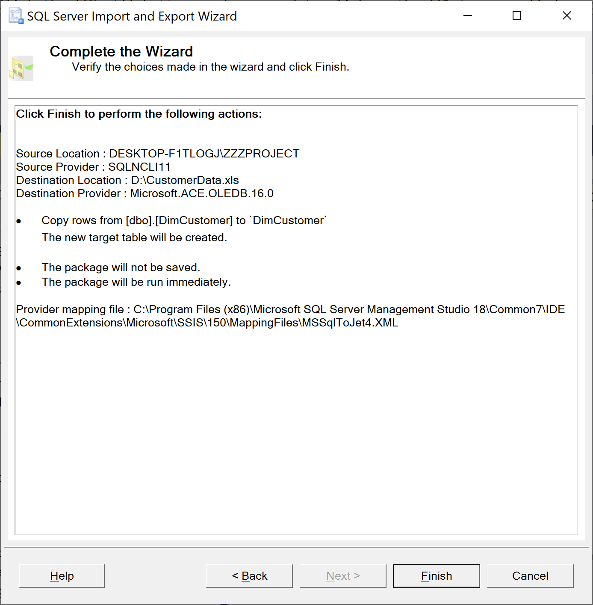 

On the **Complete the Wizard** dialog, you can check all the settings set during of exporting process. If everything is right, click the **Finish** button to start exporting the SQL database to Excel.

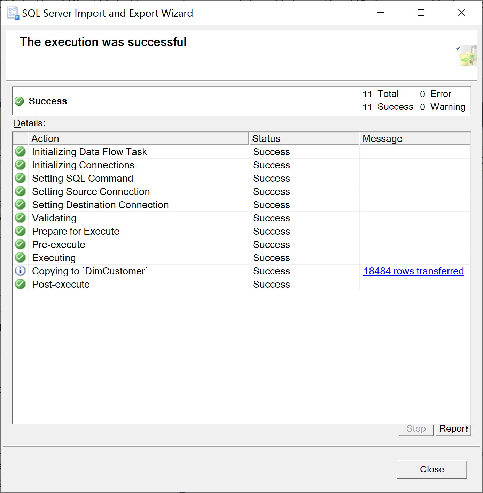 

You can view the exporting process. When it completes, click on the **Close** button and open the `CustomerData.xls` file.

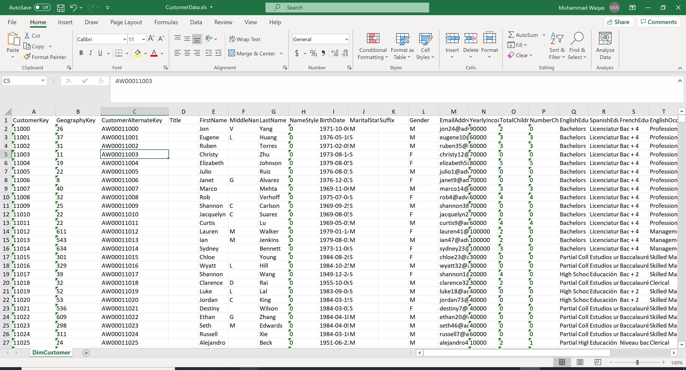 
