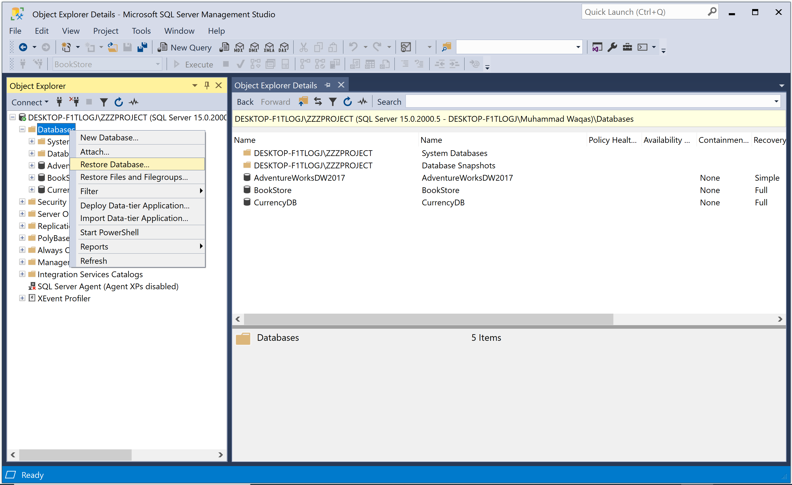
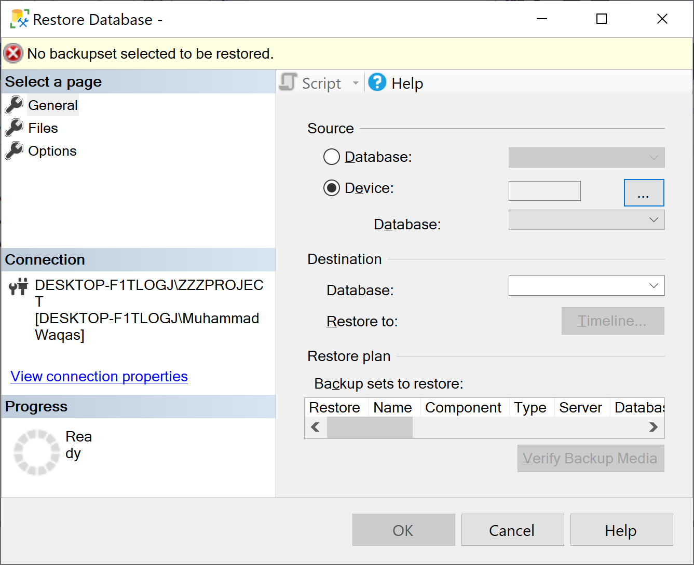
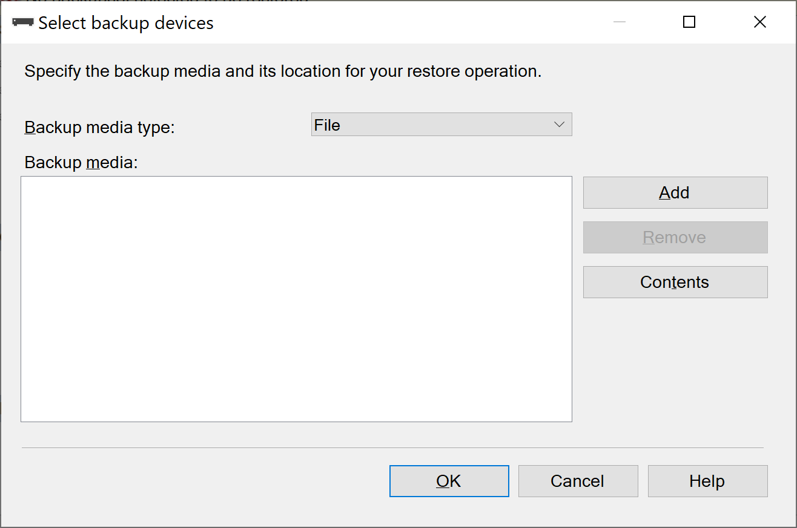
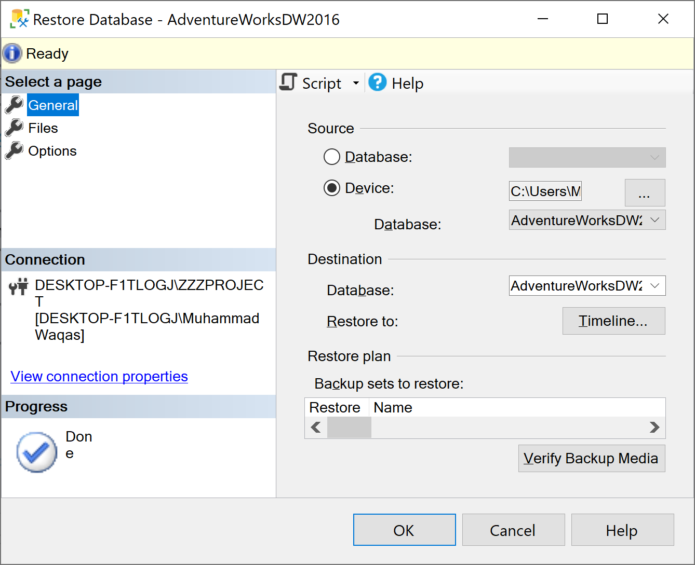
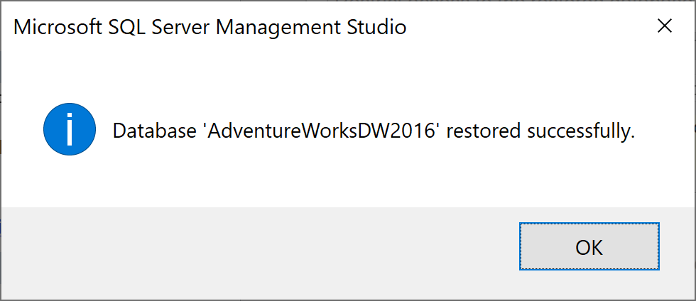
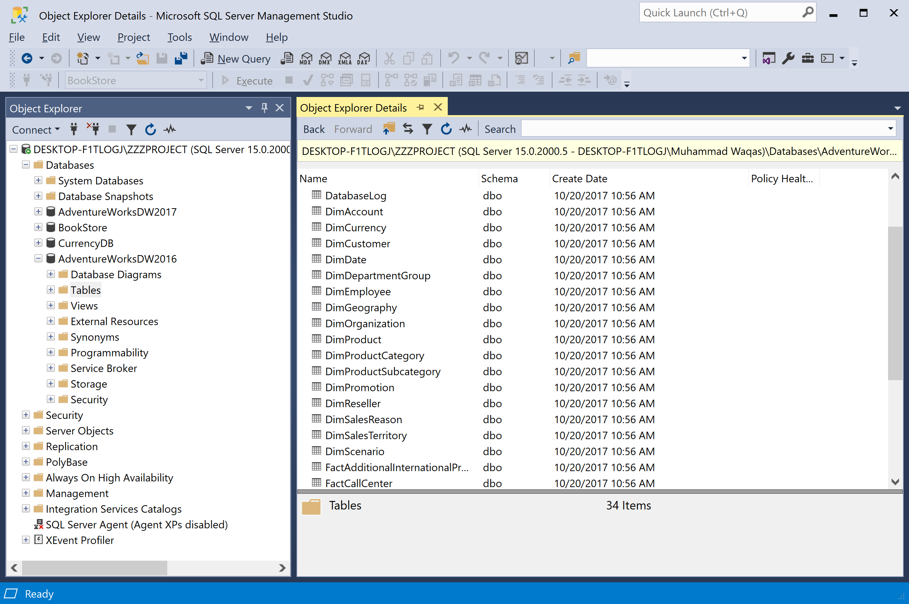

# Restore a Database Backup

SQL Server database restoration is performed for Full, Differential, File, or Filegroup database backup. The following is the step-by-step process to restore the database in SQL Server from the `.bak` file. You can try restoring the backup file by using SQL Server Management Studio (SSMS), or by executing Transact-SQL (T-SQL) query.

To restore your database, open **SQL Server Management Studio (SSMS)** and connect to your SQL Server instance.

Right-click the **Databases** in Object Explorer and select **Restore Database...**



On the **General** page, use the **Source** section to specify the source and location of the backup sets to restore. 



Select **Device** and then click the ellipses (`...`), it will open the **Select backup devices** dialog to locate your backup file.



Click on the **Add** button and navigate to where your .bak file is located. 


Select the `.bak` file and then click the **OK** button. Select the **OK** button again to close the **Select backup devices** dialog.



In the **Destination** section, the Database field is automatically populated with the name of the database to be restored. To change the name of the database, enter the new name in the **Database** field. 

Select **OK** to restore the backup of your database.



When the restore process completes successfully, click the **OK** button.



## Using Transact-SQL

You can also restore a full database backup by executing the following statement.

```csharp
USE [master]
GO
RESTORE FILELISTONLY 
FROM DISK = 'C:\Users\Muhammad Waqas\Desktop\backup\AdventureWorksDW2016.bak'


USE [master]
GO
RESTORE DATABASE AdventureWorksDW2016_Data FROM DISK = 'C:\Users\Muhammad Waqas\Desktop\backup\AdventureWorksDW2016.bak' WITH 
MOVE 'AdventureWorksDW2016_Data' TO 'C:\Users\Muhammad Waqas\AdventureWorksDW2016.mdf',
MOVE 'AdventureWorksDW2016_log' TO 'C:\Users\Muhammad Waqas\AdventureWorksDW2016.ldf', REPLACE
```
