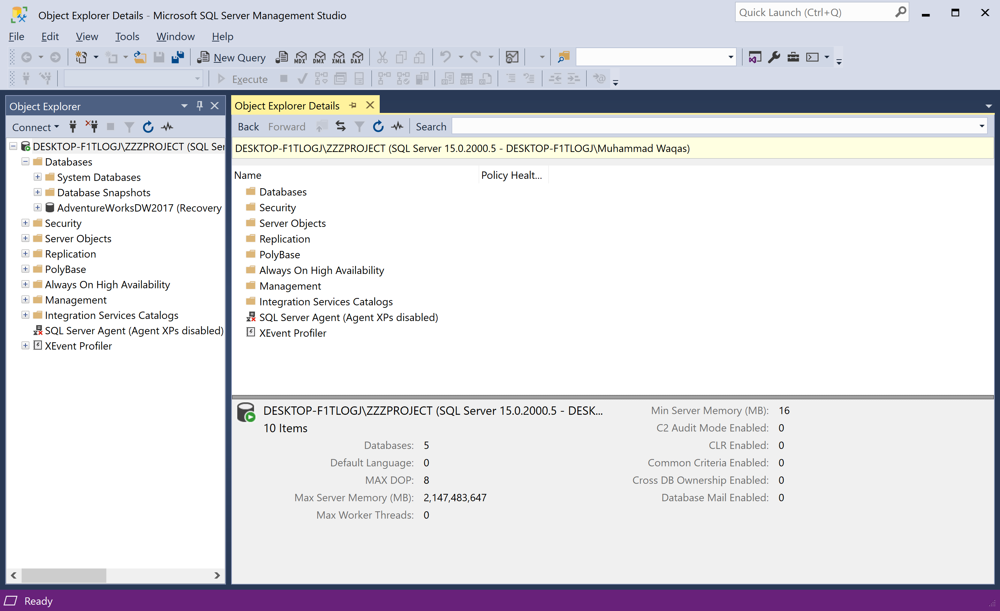
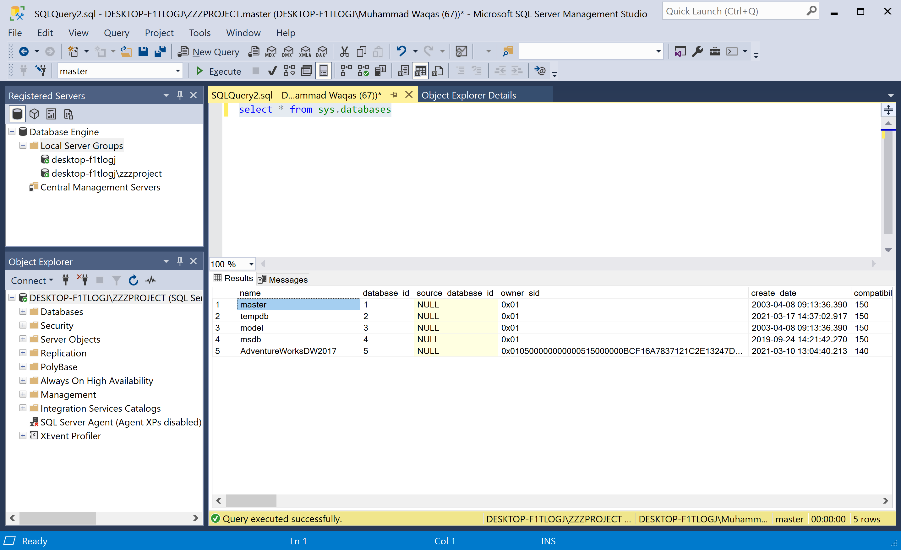
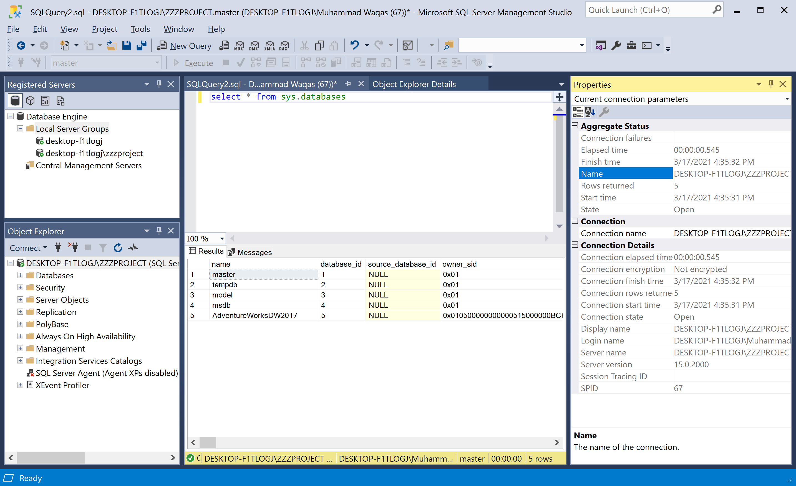
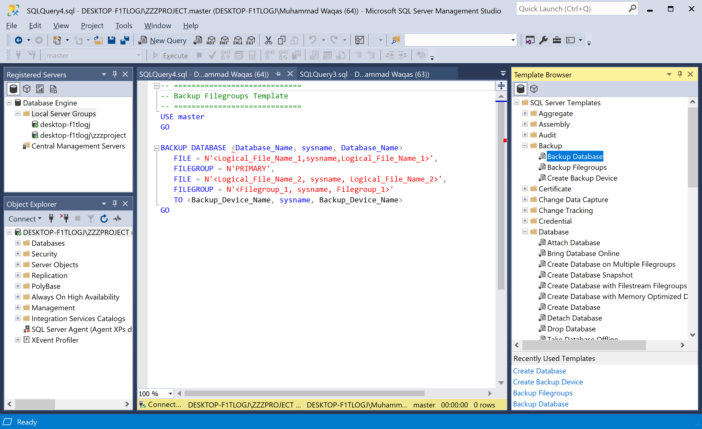

# SSMS Components

SQL Server Management Studio has various window components that are available in the workspace. Let's open the SQL Server Management Studio or SSMS.


## Object Explorer

The **Object Explorer** provides a hierarchical user interface to view and manage the objects in each instance of SQL Server. 

 - **Databases:** Holds the databases that are available on the server. It includes databases that belong to Database Engine, Analysis Services, Reporting Services, and Integration Services.
 - **Security:** It contains all Security related things. Use this folder to Create Logins, Server Roles, etc.
 - **Server Objects:** This folder contains information about Linked Server, Service Brokers, System Endpoints, Database Mirroring, etc.
 - **Replication:** This folder contains information about Subscriptions and publications.
 - **Management:** Use this folder for maintenance, such as Checking Server Logs, Session health, etc. This folder is used to create Maintenance Plans.

The **Object Explorer Details** pane presents a tabular view of instance objects and the capability to search for specific objects. 



This view is more granular than the view in **Object Explorer**. You can use **Object Explorer Details** to manipulate multiple objects at the same time. For example, in this window, you can select multiple databases and then either delete them or script them out simultaneously.

The capabilities of **Object Explorer** vary slightly depending on the type of server but generally include the development features for databases and management features for all server types.

## Registered Servers

You can open the **Registered Servers** window from the **View > Registered Servers** menu option.


The **Registered Servers** window appears above or adjacent to **Object Explorer**. You can drag it and dock it in various locations. 

 - **Registered Servers** lists servers that you manage frequently. 
 - You can add and remove servers from this list.
 - The only servers listed are the SQL Server instances on the computer where you are running Management Studio.

## Query Window

If you want to write a query against any database, you have to click the **New Query** button.


Let's add the following simple query.

```csharp
select * from sys.databases
```

To execute your query, click on the **Execute** button
 
 

The results of your queries also appear here.

 

## Properties Window 

You can see the **Properties** window when the **Query Window** is open. if it is not open, right-click inside **Query Window** and select **Properties Window**. The view displays the basic properties of the query. 

 

For example, it shows the time that a query started, the number of rows returned, and connection details.

## Template Browser

Template Browser has various pre-built T-SQL templates. You can use these templates to perform various functions, such as creating or backing up a database.

 

