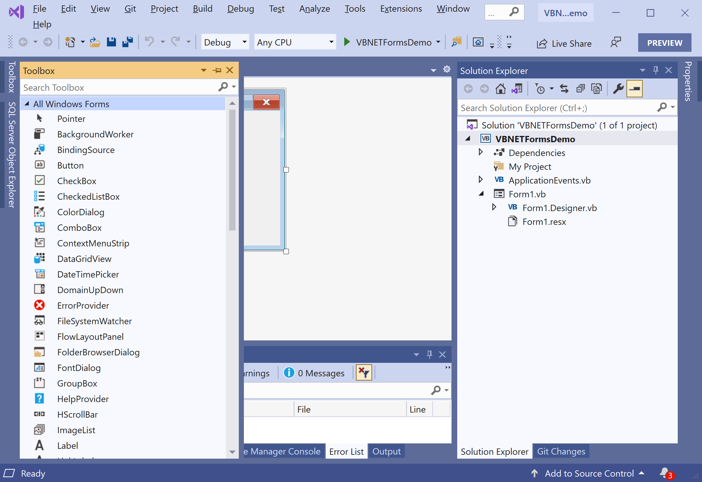
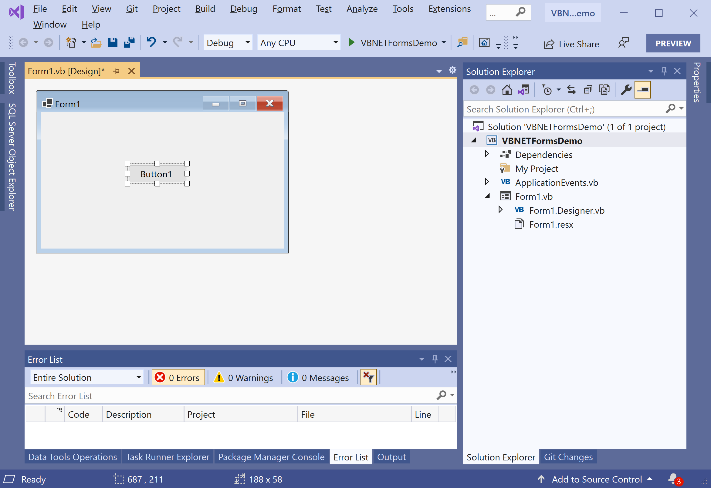
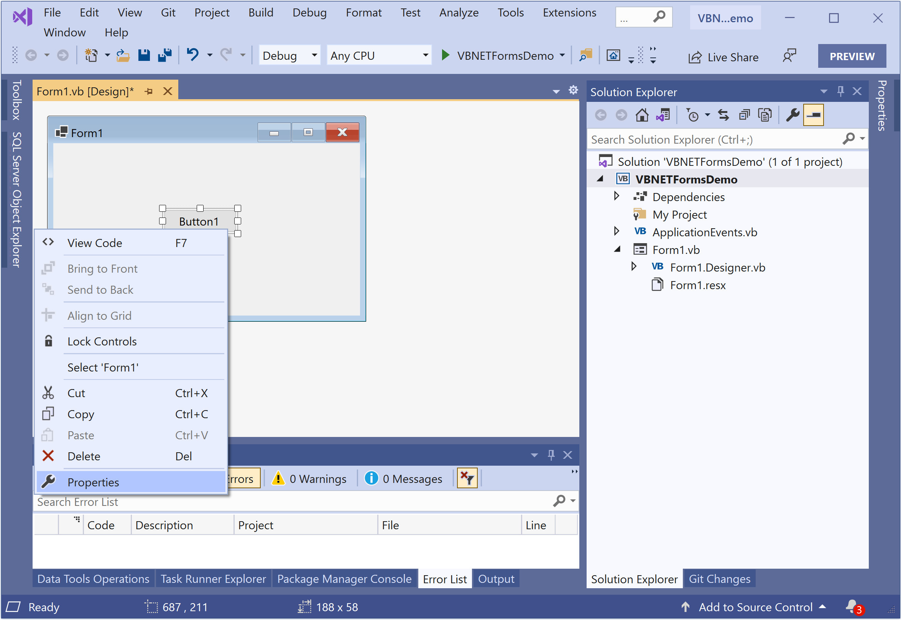
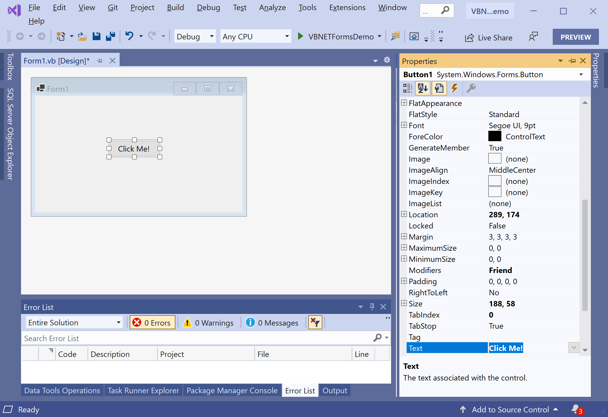
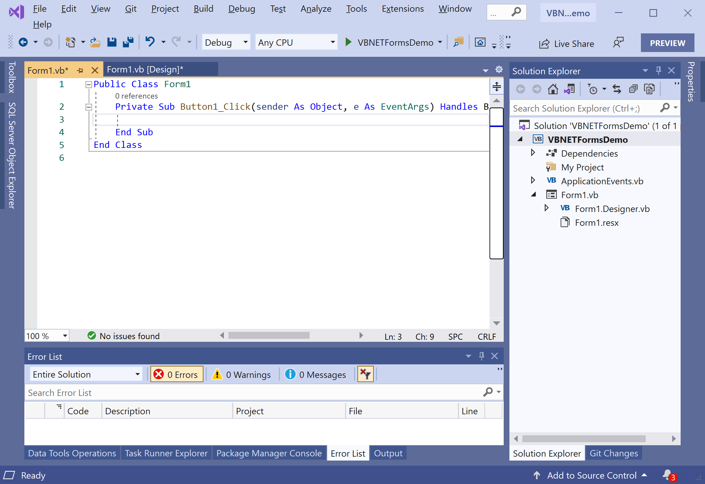
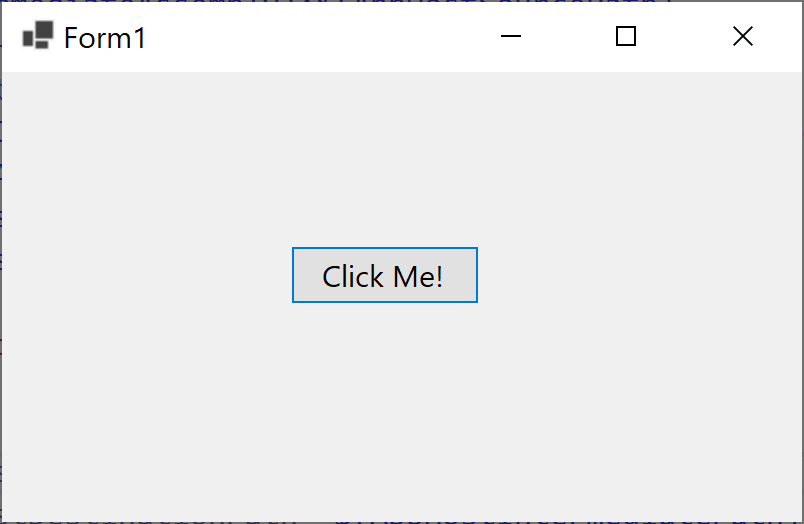
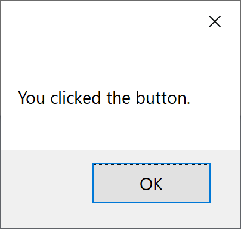

# Basic Controls

VB.NET Controls are the pillars that help in creating GUI Based Applications in VB.Net quickly and easily. Windows Forms contains various controls that you can add to forms: controls that display text boxes, buttons, drop-down boxes, radio buttons, and even Web pages.

 - Controls are objects that are contained within form objects. 
 - Each type of control has its own set of properties, methods, and events that make it suitable for a particular purpose. 
 - You can manipulate controls in the designer and write code to add controls dynamically at run time.

A control is a user interface element used in the VB.Net Form to perform some action. Every control has three features in VB.Net.

 - Properties
 - Methods
 - Events

The following are the most commonly used controls in the VB.Net.

| Control Name     | Description                                                     |
| :----------------| :---------------------------------------------------------------|
| Forms            | The container for all the controls that make up the user interface. |
| TextBox          | Used to give the input and to display the text                  |
| Label            | Used to display the Text                                        |
| Button           | Used to perform some action                                     |
| CheckBox         | Used to select multiple items from the list                     |
| RadioButton      | Used to select one item from the list                           |
| DropDownList     | Used to select items from the list                              |
| ListBox          | Used to display the list of items at a time                     |
| Image            | Used to display an image                                        |
| ImageButton      | Used to display an image and also to perform an action          |
| LinkButton       | Used to redirect from one page to another page                  |
| Panel            | Used to hold a list of controls                                 |
| CheckBoxList     | Used to give multiple items in one control                      |
| RadioButtonList  | Used to give multiple items in one control                      |
| GridView         | Used to display the backend database in the front view          |

On the Toolbox pane, you will see all the available controls, and you can easily drag it to the form.



Let's drag a **Button** control to the form. 



Select the **Properties** from the right-click context menu.
 


It will open the **Properties** windows, and you can easily update the properties on the selected control from this window.



Let's change the **Text** property of a Button control to **Click Me!** and you will see that the text of the button is changed. Now to define the click event of a button, double click on the button and it will open the code file containing the event definition.

### Button Control Events 

The following are the most commonly used events of the **Button** control.

| Name                     | Description                                                                  |
| :------------------------| :----------------------------------------------------------------------------|
| Click                    | Occurs when the control is clicked.                                          |
| DoubleClick              | Occurs when the user double-clicks the Button control.                       |
| GotFocus                 | Occurs when the control receives focus.                                      |
| TabIndexChanged          | Occurs when the TabIndex property value changes.                             |
| TextChanged              | Occurs when the Text property value changes.                                 |
| Validated                | Occurs when the control is finished validating.                              |

### Button Control Properties

| Name                     | Description                                                                  |
| :------------------------| :----------------------------------------------------------------------------|
| AutoSizeMode             | Gets or sets the mode by which the Button automatically resizes itself.      |
| BackColor                | Gets or sets the background color of the control.                            |
| BackgroundImage          | Gets or sets the background image displayed in the control.                  |
| DialogResult             | Gets or sets a value that is returned to the parent form when the button is clicked. This is used while creating dialog boxes. |
| ForeColor                | Gets or sets the foreground color of the control.                            |
| Image                    | Gets or sets the image that is displayed on a button control.                |
| Location                 | Gets or sets the coordinates of the upper-left corner of the control relative to the upper-left corner of its container. |
| TabIndex                 | Gets or sets the tab order of the control within its container.              |
| Text                     | Gets or sets the text associated with this control.                          |

### Button Control Methods

The following are the most commonly used methods of the **Button** control.

| Name                     | Description                                                                  |
| :------------------------| :----------------------------------------------------------------------------|
| GetPreferredSize         | Retrieves the size of a rectangular area into which a control can be fitted. |
| NotifyDefault            | Notifies the Button whether it is the default button so that it can adjust its appearance accordingly. |
| Select                   | Activates the control.                                                       |
| ToString                 | Returns a String containing the name of the Component, if any. This method should not be overridden. |




Let's add the following code, which will display a message when you click the button.

```csharp
Public Class Form1
    Private Sub Button1_Click(sender As Object, e As EventArgs) Handles Button1.Click
        MessageBox.Show("You clicked the button.")
    End Sub
End Class
```

Let's run your application, and you will see the following dialog.



Now click the button, and you will see the following message.



