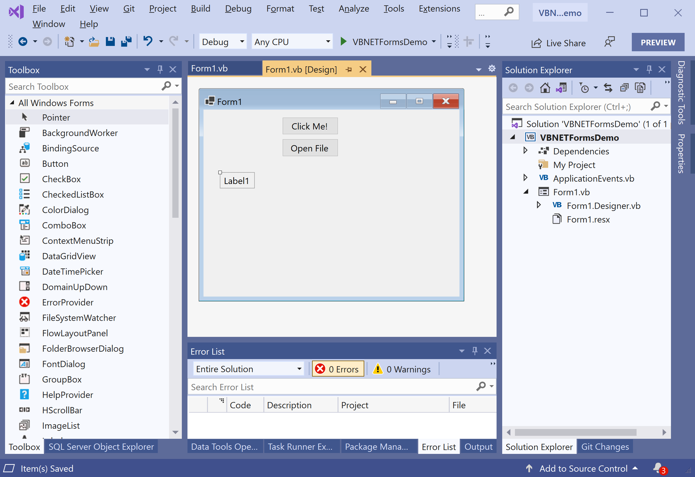
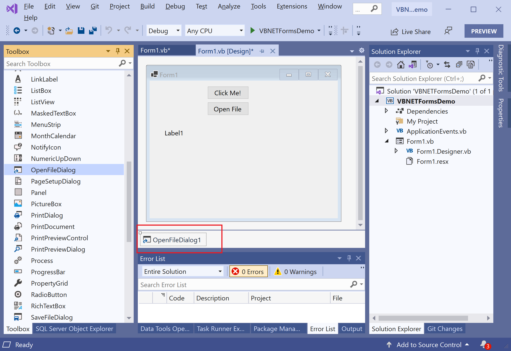
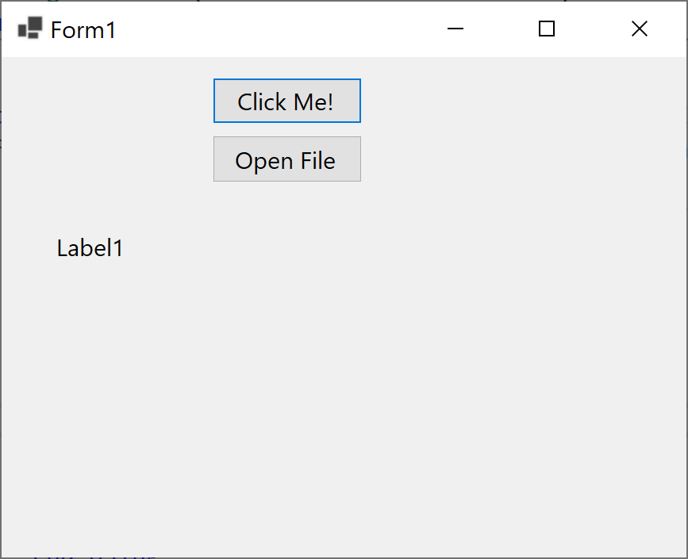
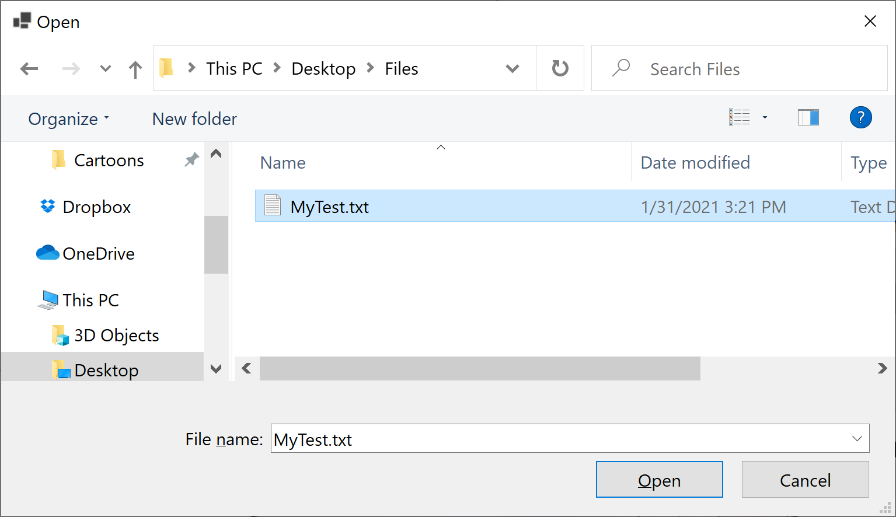
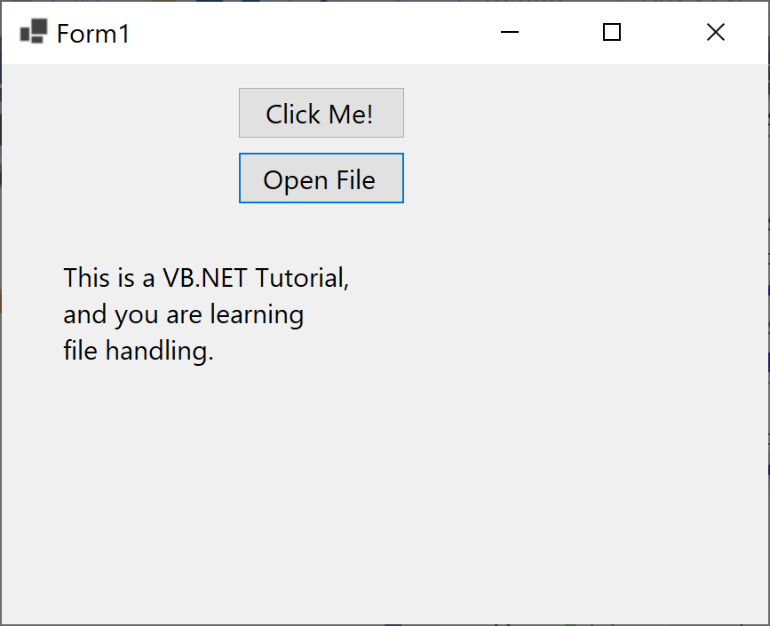

# Dialog Box

A **Dialog box** is a temporary Window for an application that accepts user response through mouse or keyboard to open a file, save a file, notifications, alert messages, open file dialog box, etc. It is also useful to create communication and interaction between the user and the application.

The following are the most commonly used dialog box controls.

| Dialog Box        | Description                                                                 |
| :-----------------| :---------------------------------------------------------------------------|
| `ColorDialog`    | It represents a common dialog box that displays available colors along with controls that enable the user to define custom colors.
| `FontDialog`     | It prompts the user to choose a font from among those installed on the local computer and lets the user select the font, font size, and color.
| `OpenFileDialog` | It prompts the user to open a file and allows the user to select a file to open.
| `SaveFileDialog` | It prompts the user to select a location for saving a file and allows the user to specify the name of the file to save data.
| `PrintDialog`    | It lets the user print documents by selecting a printer and choosing which sections of the document to print from a Windows Forms application.
 
All VB.NET Dialog box inherits the `CommonDialog` class and overrides the `RunDialog()` method of the base class to create the `OpenFileDialog` box, `PrintDialogbox`, `Color`, and `FontDialog` box. The `RunDialog()` method is automatically called in a windows form when the dialog box calls its `ShowDialog()` method.

The `ShowDialog()` method is used to display all the dialog box controls at run-time. It returns a value of the type of `DialogResult` enumeration which contains the following values.

| Enum Value  | Description                                                                 |
| :-----------| :---------------------------------------------------------------------------|
| `Abort`    | Returns `DialogResult.Abort` value, when user clicks an **Abort** button. |
| `Cancel`   | Returns `DialogResult.Cancel`, when user clicks a **Cancel** button.      |
| `Ignore`   | Returns `DialogResult.Ignore`, when user clicks an **Ignore** button.     |
| `No`       | Returns `DialogResult.No`, when user clicks a **No** button.               |
| `None`     | Returns nothing and the dialog box continues running.                        |
| `OK`       | Returns `DialogResult.OK`, when user clicks an **OK** button.              |
| `Retry`    | Returns `DialogResult.Retry`, when user clicks an **Retry** button.       |
| `Yes`      | Returns `DialogResult.Yes`, when user clicks an **Yes** button.           |

Let's consider the following simple example in which we will open the text file, read all the data and write it on the Label control. So first we need to add a label and a button to our windows forms application as shown below.



Change the **Text** and **Name** properties of a button to **Open File** and **openFileBtn** respetively. To open a file using `OpenFileDialog`, drag the `OpenFileDialog` control to the main form.



To add the functionality of opening a text file write its data to the **Label**, double-click on the **Open File** button and add the following code.

```csharp
Private Sub openFileBtn_Click(sender As Object, e As EventArgs) Handles openFileBtn.Click
    If OpenFileDialog1.ShowDialog <> Windows.Forms.DialogResult.Cancel Then

        Using sr As StreamReader = File.OpenText(OpenFileDialog1.FileName)

            Label1.Text = sr.ReadToEnd()

        End Using
    End If
End Sub
```

We have a text file called `MyText.txt` which contains the following text.

```csharp
This is a VB.NET Tutorial,
and you are learning 
file handling.
```

Let's run your application and you will see the following dialog.



Now click the **Open File** button and you will see the Open File Dialog in which you can select the file.



Select the text file and click the **Open** button.

