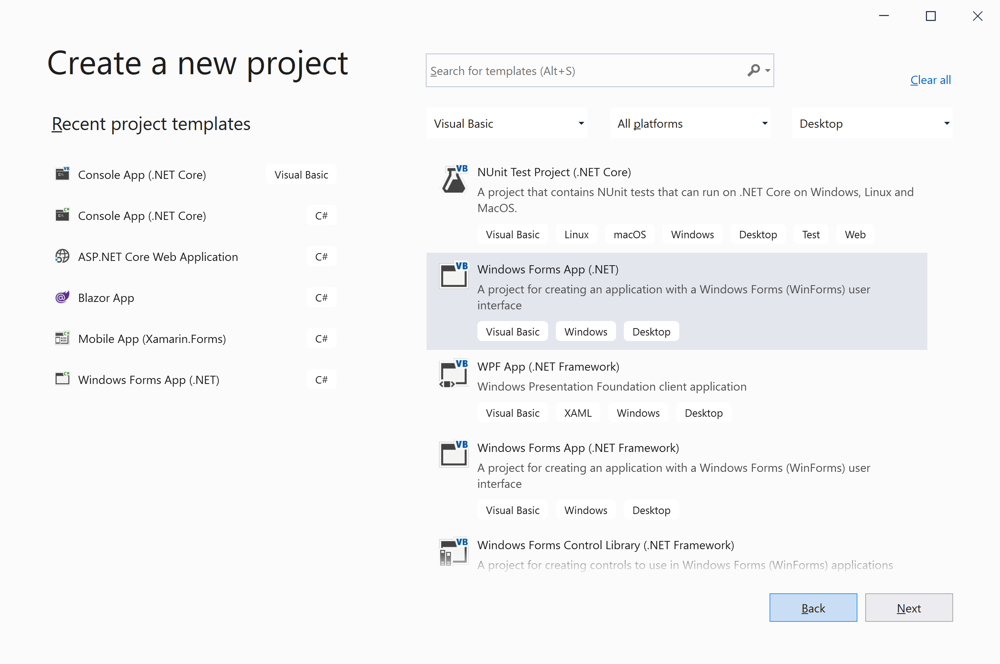
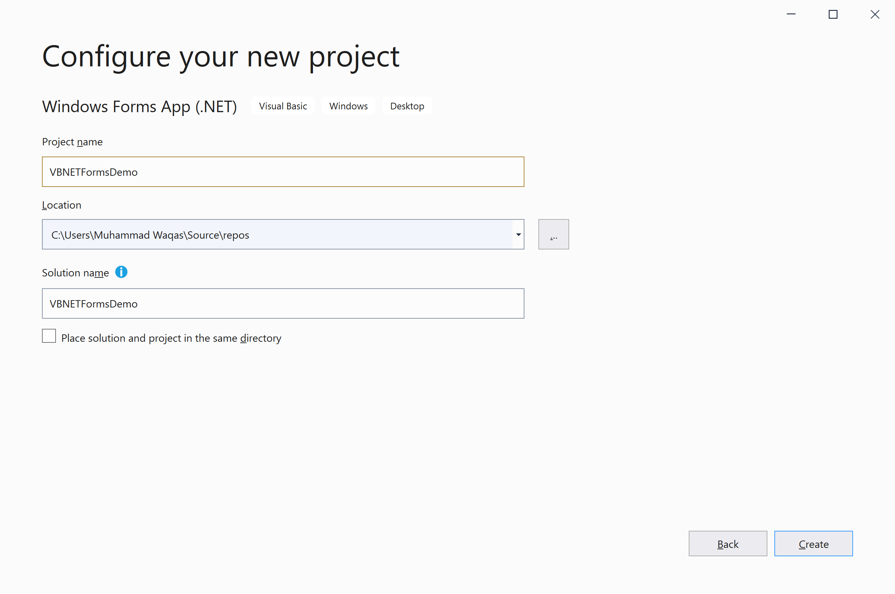
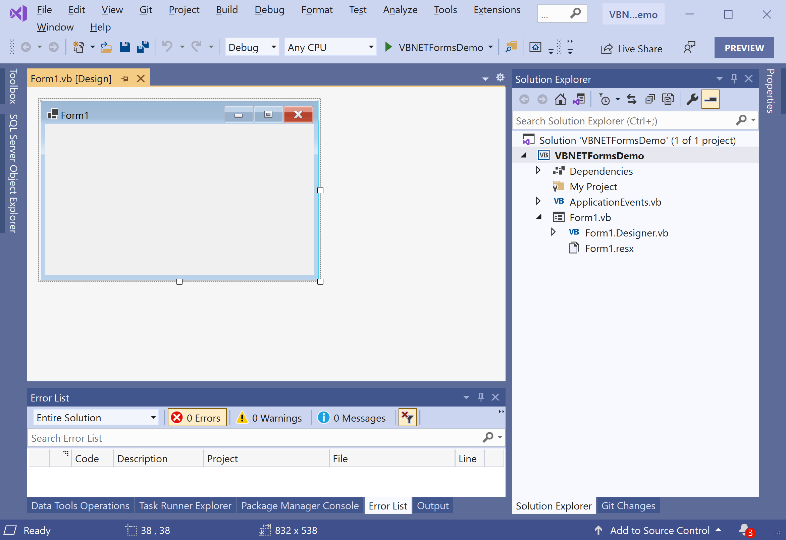

# Windows Forms Application

Windows Forms is the smart-client component of the .NET Framework and .NET Core. It contains a set of managed libraries that simplify common application tasks such as reading and writing to the file system. 

 - When you use a development environment like Visual Studio, you can create Windows Forms applications that display information, request input from users, and communicate with remote computers over a network.
 - A form is a visual surface on which you display information to the user. 
 - You ordinarily build Windows Forms applications by adding controls to forms and developing responses to user actions, such as mouse clicks or key presses.

## Features 

There are many features in Windows Forms that make implementing common tasks fast and easy, such as support for creating dialog boxes, printing, adding Help and documentation, and localizing your application to multiple languages. 

Windows Forms relies on the robust security system of the .NET Framework. With this system, you can release more secure applications to your customers.

## Create Windows Forms Application

Let's start with creating a new Window Forms Application by selecting the **Window Forms App(.NET)** template.

Click on the **Next** button.

On the **Configure your new project** dialog, enter the name for your application and click the **Create** button.

It will create the VB.NET Windows Forms application with all the required files.
