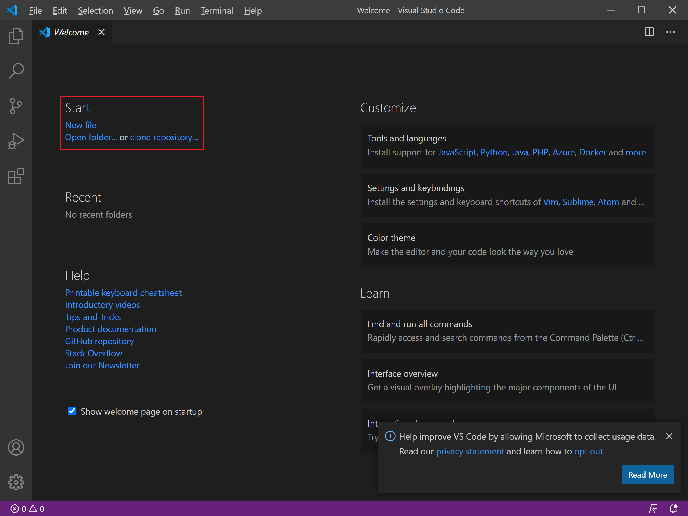
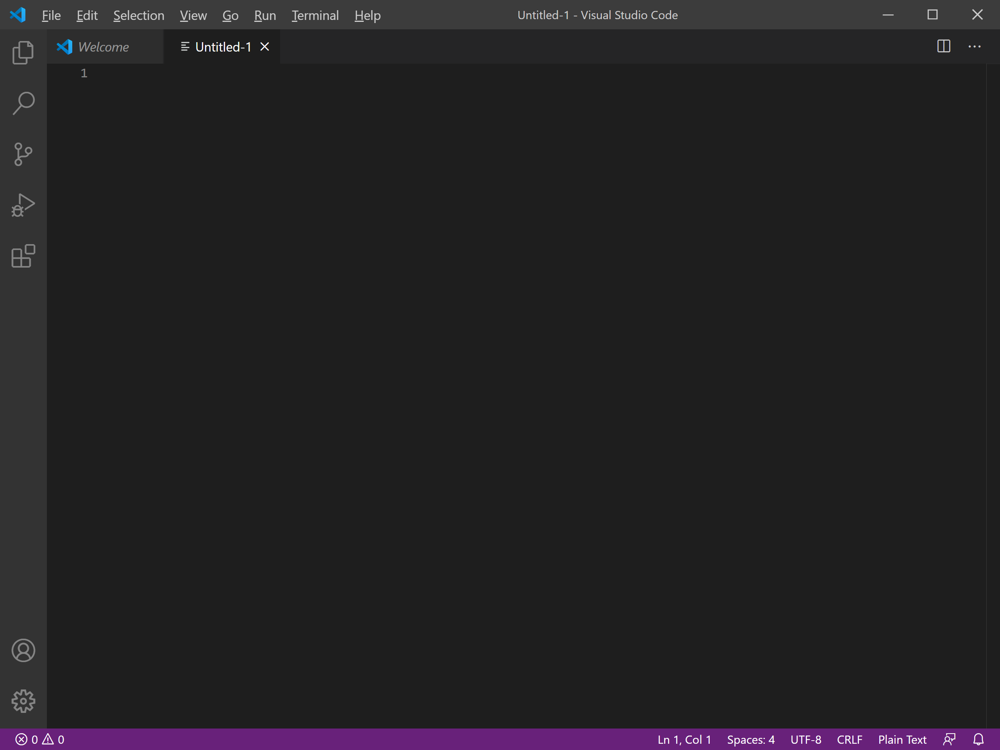
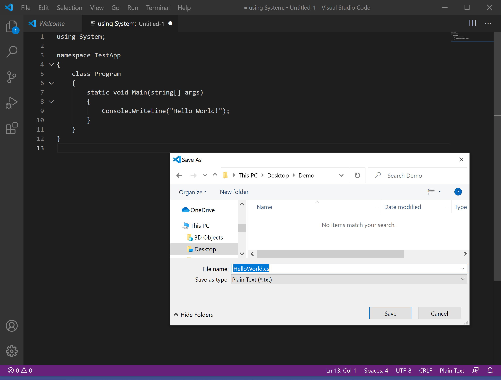
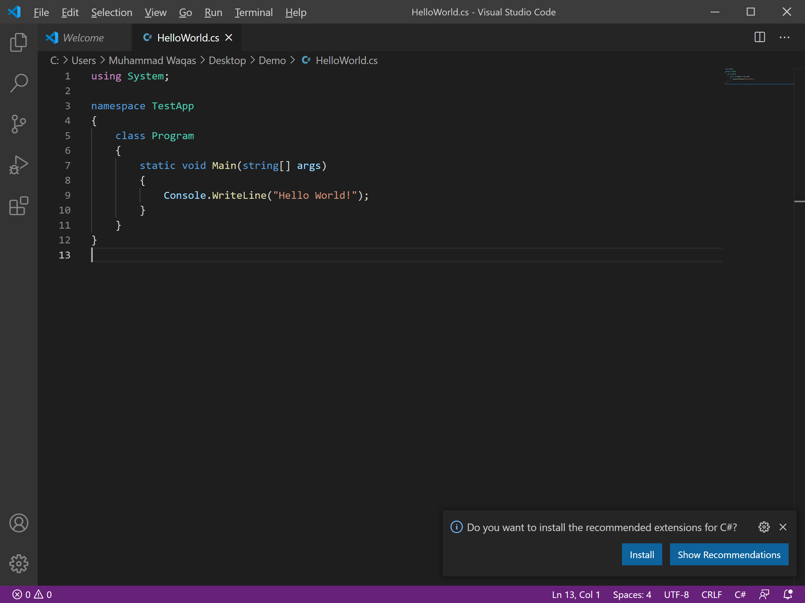
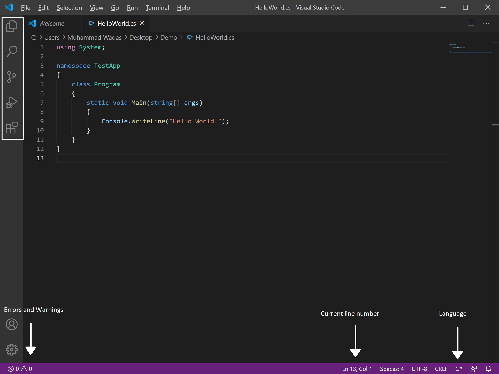
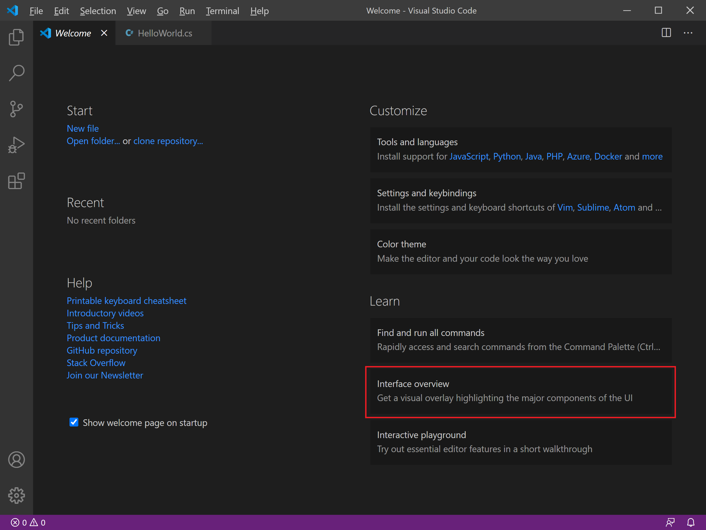
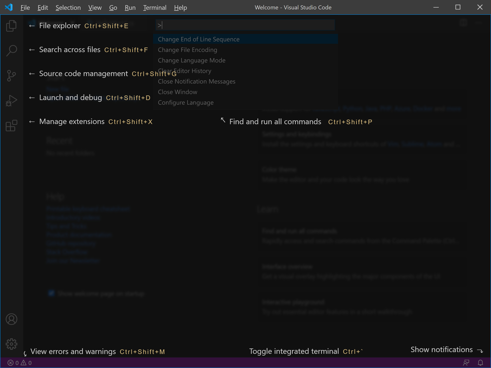

# Basics of VS Code

In this article, we will set up the Visual Studio Code and give an overview of the basic features. Once the Visual Studio Code is installed, open it, and you will see a welcome screen.



You can open a folder or create a new file by clicking on the **New file** link.



It will open a blank file, now let's use a C# code here by adding the following code, which will print **"Hello, World!"** message on the console.

```csharp
using System;

namespace TestApp
{
    class Program
    {
        static void Main(string[] args)
        {
            Console.WriteLine("Hello World!");
        }
    }
}
```

To save the file, select the **File > Save** menu option.



Enter `HelloWorld.cs` as a **File name** and click the Save button.



Now you will see a color change of the code.

If you look at the interface, at the bottom, you will see the status bar where you will find helpful information, such as **Errors and Warnings**, **Current line number**, and **Programming language**, etc.



On the left side, we have an activity bar that contains **File Explorer**, **Search**, **Source Control**, etc.

If you need to find where the things are, go to the welcome screen.



Select the **Interface overview** under a **Learn** section.



You will see parts of the interface overlaid on top.

On the Visual Studio Code you can also: 

 - Install support for your favorite programming language.
 - Change your keyboard shortcuts and easily migrate from other editors using keybinding extensions.
 - Customize your editor with themes.
 - Explore VS Code features in the Interactive Editor Playground.

