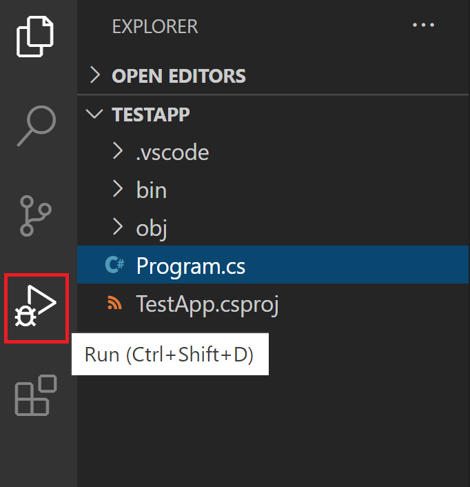
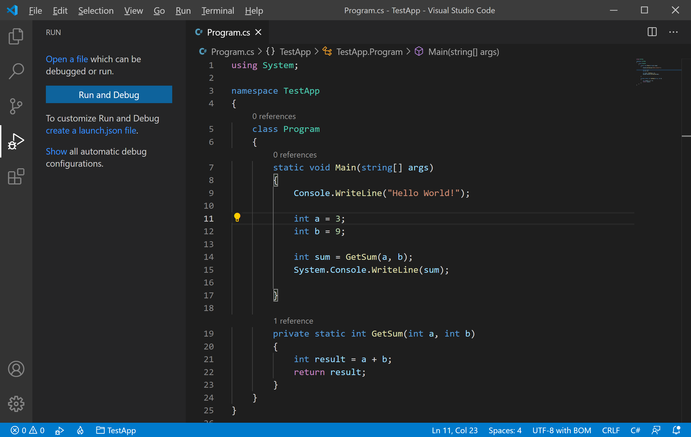
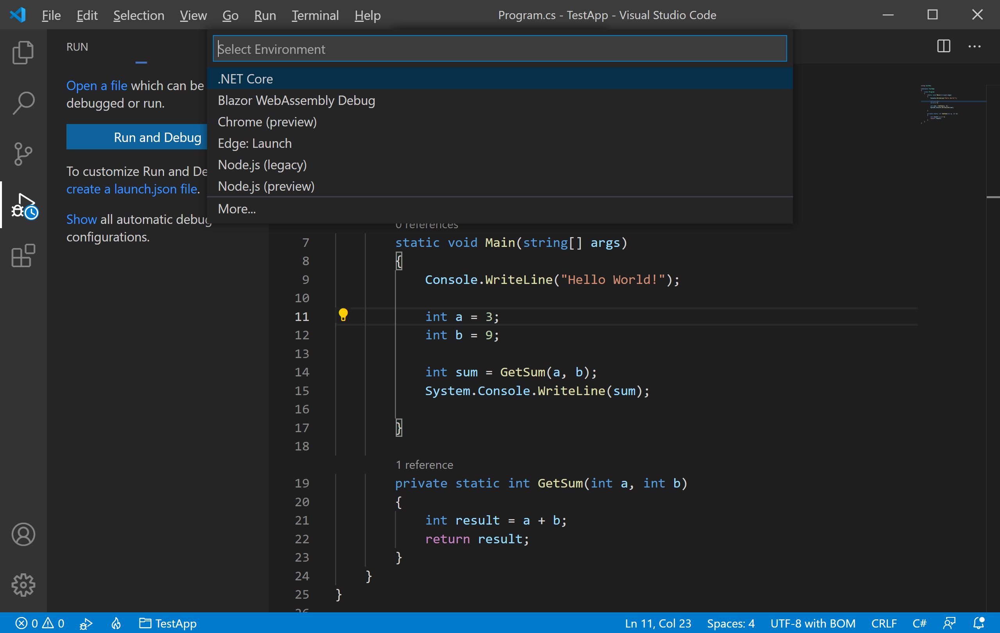
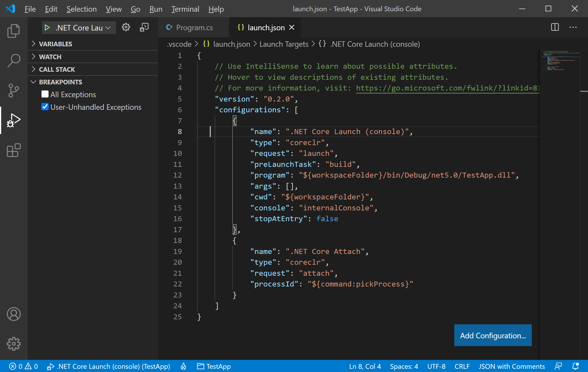
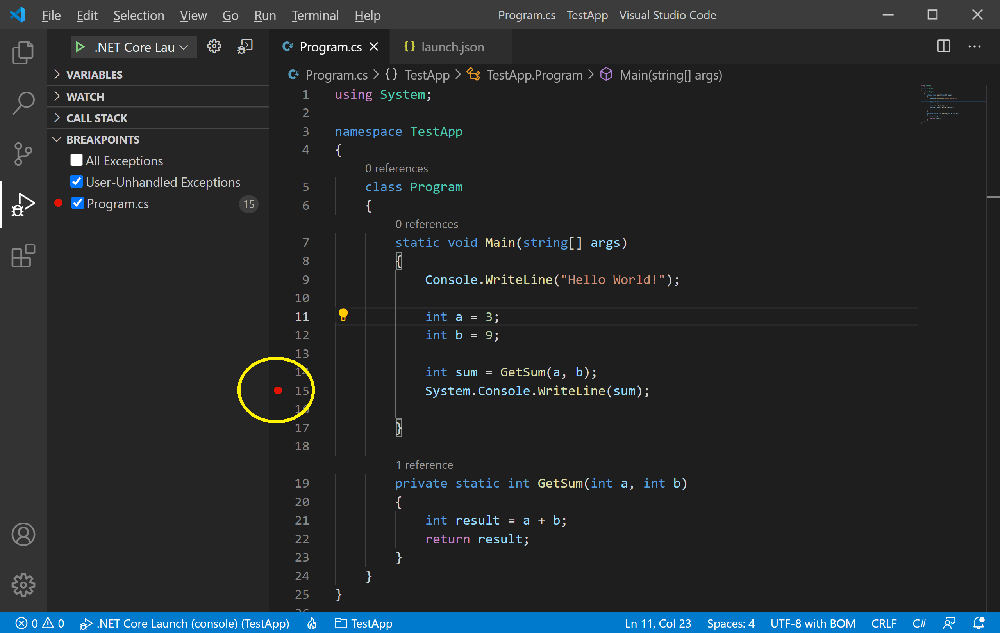
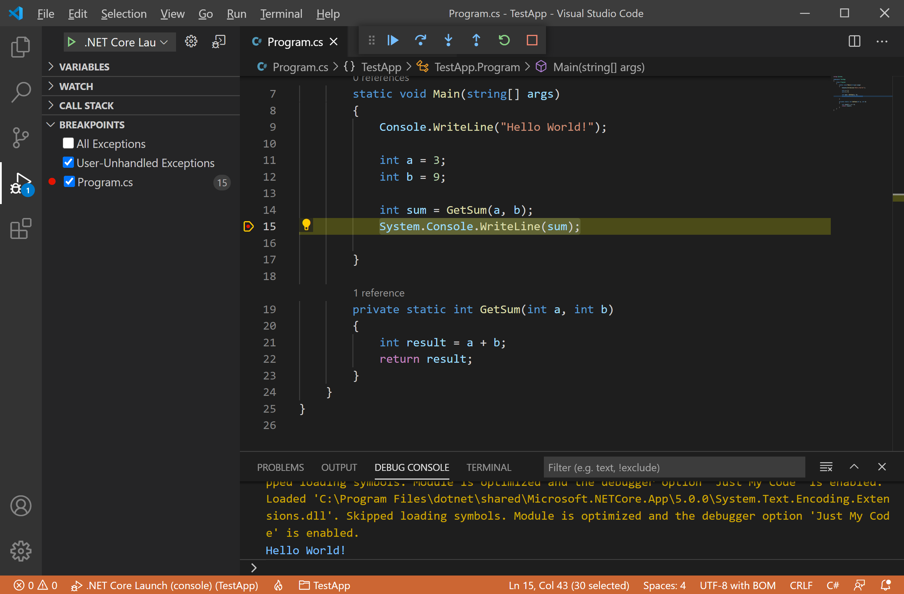
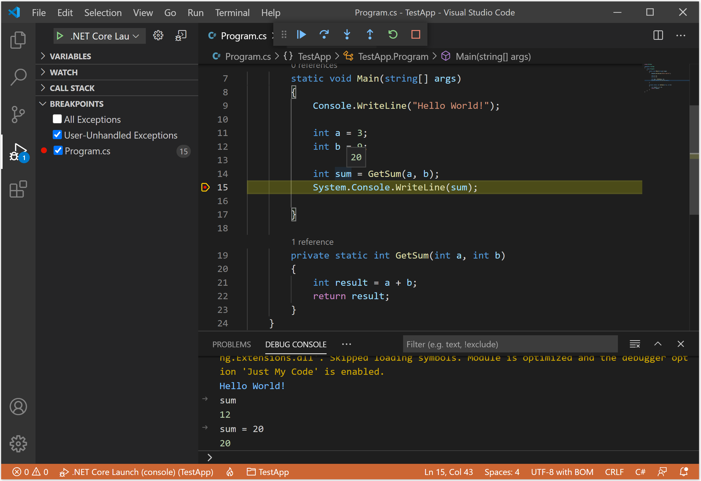
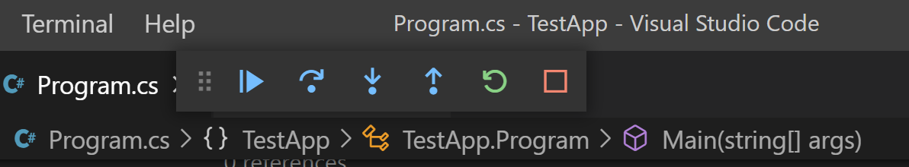
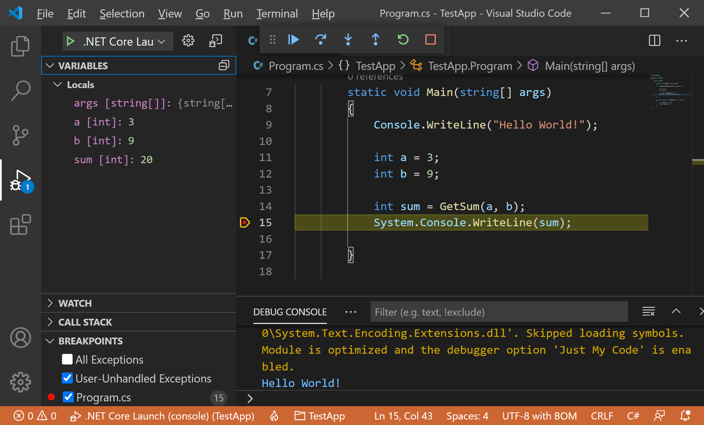
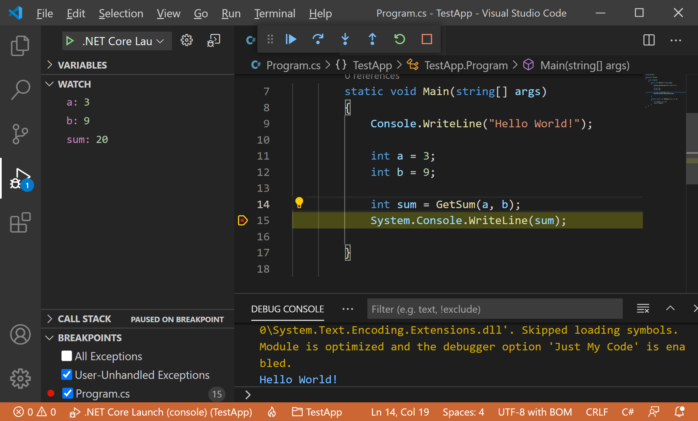

# Debugging

One of the key features of the Visual Studio Code is its great debugging support. It has built-in debugging support for languages and runtimes including C#, PHP, Ruby, Go, Python, C++, PowerShell, and many others. 

Look for Debuggers extensions in VS Code Marketplace or select Install Additional Debuggers in the top-level Run menu.

## Use Debug Build Configuration

Debug and Release are .NET Core's built-in build configurations. You use the Debug build configuration for debugging and the Release configuration for the final release distribution.

 - In the Debug configuration, a program compiles with full symbolic debug information and no optimization. 
 - Optimization complicates debugging because the relationship between source code and generated instructions is more complex. 
 - The release configuration of a program has no symbolic debug information and is fully optimized.

By default, Visual Studio Code launch settings use the Debug build configuration, so you don't need to change it before debugging.

## Run view

To bring up the Run view, select the Run icon in the **Activity Bar** on the side of VS Code. You can also use the keyboard shortcut `Ctrl+Shift+D`.

If you are running and debugging for the first time then debugging is not yet configured.

To run or debug a simple app in VS Code, select **Run and Debug** on the Debug start view or press F5 and VS Code will try to run your currently active file.

VS Code will try to automatically detect your debug environment, but if this fails, you will have to choose it manually, select **.NET Core**.

It will create a `.vscode` folder and add the `launch.json` file to your workspace.

The Run view displays all information related to running and debugging and has a top bar with debugging commands and configuration settings.

## Set a Breakpoint

A breakpoint temporarily interrupts the execution of the application before the line with the breakpoint is executed. To set a breakpoint on any line you can either click in the left margin of the code window or press `F9` or choose **Run > Toggle Breakpoint** from the menu while the line of code is selected.

Visual Studio Code indicates the line on which the breakpoint is set by displaying a red dot in the left margin.

## Start Debugging

To start the debugging, select the green arrow at the top of the pane, next to **.NET Core Launch (console)**.

The **Debug Console** window lets you interact with the application you are debugging. Let's enter `sum` in the typing area and press enter, it will display the value of that variable.
 

You can change the value of variables to see how it affects your program. Let's type `sum = 20` and you will see the value is changed.

## Debug Actions

Once a debug session starts, the Debug toolbar will appear on the top of the editor.

 - Continue / Pause `F5`
 - Step Over `F10`
 - Step Into `F11`
 - Step Out `Shift+F11`
 - Restart `Ctrl+Shift+F5`
 - Stop `Shift+F5`

## Data Inspection

Variables can be inspected in the **VARIABLES** section of the Run view or by hovering over their source in the editor. 

 - Variable values can be modified with the **Set Value** action from the variable's context menu. 
 - Additionally, you can use the **Copy Value** action to copy the variable's value, or **Copy as Expression** action to copy an expression to access the variable.

Variables and expressions can also be evaluated and watched in the Run view's **WATCH** section.

