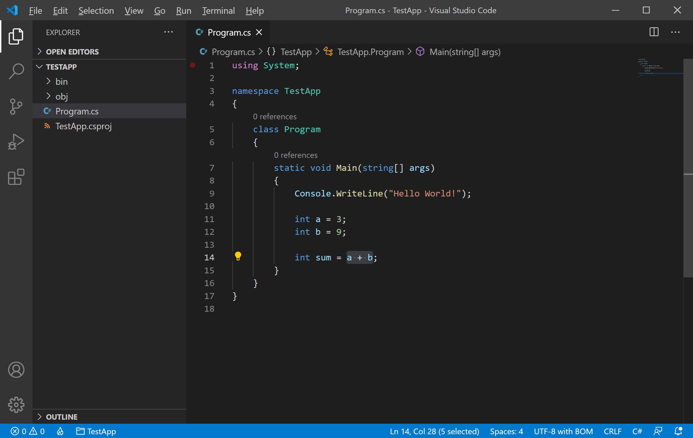
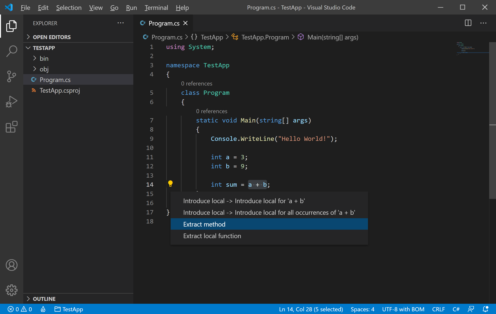
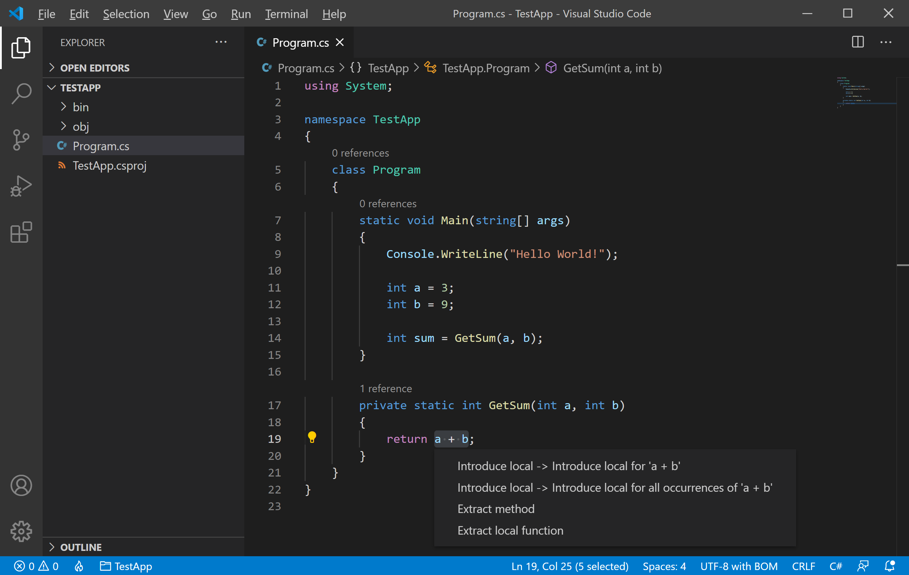

# Refactoring

Source code refactoring can improve the quality and maintainability of your project by restructuring your code while not modifying the runtime behavior. Visual Studio Code supports the following refactoring operations to improve your code-base from within your editor.

 - [Extract Method](#extract-method)
 - [Extract Variable](#extract-variable)

Refactorings are provided by a language service and the VS Code has built-in support for TypeScript and JavaScript refactoring through the TypeScript language service. 

 - Refactoring support for other programming languages is provided through VS Code extensions which contribute language services. 
 - The UI and commands for refactoring are the same across languages.

## Code Actions

In Visual Studio Code, **Code Actions** can provide both refactorings and quick fixes for detected issues which are highlighted with green squiggles. 

 - An available **Code Action** is announced by a lightbulb near the source code when the cursor is on a squiggle or selected text region. 
 - Clicking on the **Code Action** lightbulb or using the Quick Fix command `Ctrl+.` will display Quick Fixes and refactorings.
 - If you want to see refactorings without Quick Fixes, you can use the Refactor command (`Ctrl+Shift+R`).

## Extract Method

A common refactoring used to avoid duplicating code is the **Extract Method** refactoring, where you select source code that you want to reuse elsewhere and pull it out into its shared method.

For example, we have to perform an addition operation on two variables `a` and `b` and `sum` will store the result, now to move the sum operation to the method, select `a + b` and you will see a lightbulb appears on the left side.


 
Click on the lightbulb in the gutter or press (`Ctrl+.`) to see available refactorings.



Select the **Extract Method** option and you will see a method is inserted into the source code.

```csharp
using System;

namespace TestApp
{
    class Program
    {
        static void Main(string[] args)
        {
            Console.WriteLine("Hello World!");

            int a = 3;
            int b = 9;

            int sum = GetSum(a, b);
        }

        private static int GetSum(int a, int b)
        {
            return a + b;
        }
    }
}
```

## Extract Variable

You can also create a new local variable for the currently selected expression. For example, select `a + b` and press `Ctrl+.` or click on the lightbulb. 



Select the **Introduce Local** option and you will see a local variable added.

```csharp
using System;

namespace TestApp
{
    class Program
    {
        static void Main(string[] args)
        {
            Console.WriteLine("Hello World!");

            int a = 3;
            int b = 9;

            int sum = GetSum(a, b);
        }

        private static int GetSum(int a, int b)
        {
            int v = a + b;
            return v;
        }
    }
}
```

When working with classes, you can also extract a value to a new property.

## Rename Symbol

Renaming is a common operation related to refactoring source code and VS Code has a separate Rename Symbol command (`F2`). For example, we have a local variable `v` which stores the sum of two variables. 

Let rename it using this feature by selecting the `v` variable and press `F2`. 


Type the new desired name and press **Enter** and you will see all the occurrences are renamed. 

```csharp
using System;

namespace TestApp
{
    class Program
    {
        static void Main(string[] args)
        {
            Console.WriteLine("Hello World!");

            int a = 3;
            int b = 9;

            int sum = GetSum(a, b);
            System.Console.WriteLine(sum);

        }

        private static int GetSum(int a, int b)
        {
            int result = a + b;
            return result;
        }
    }
}
```

All usages of the symbol will be renamed, across files.