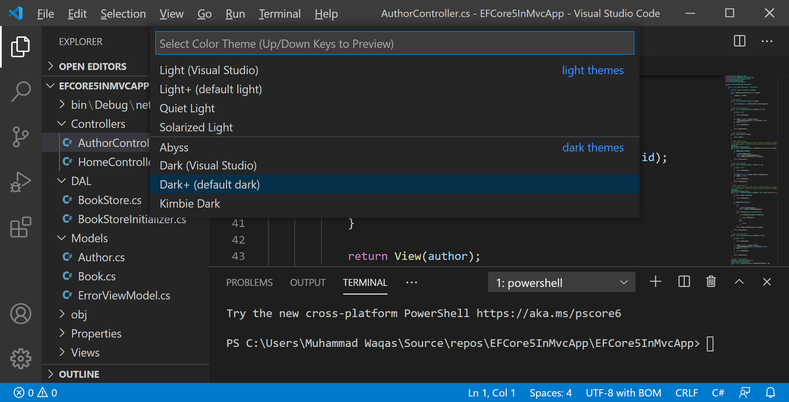
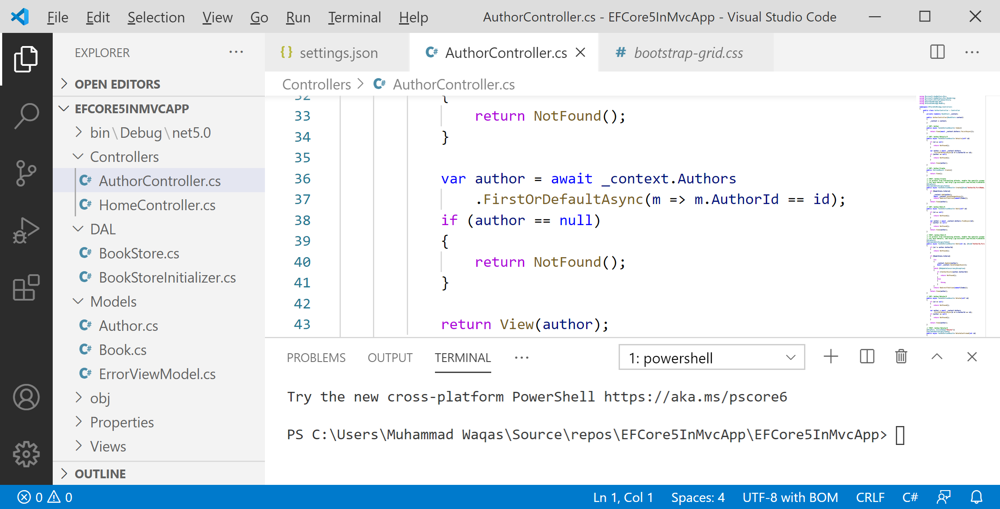
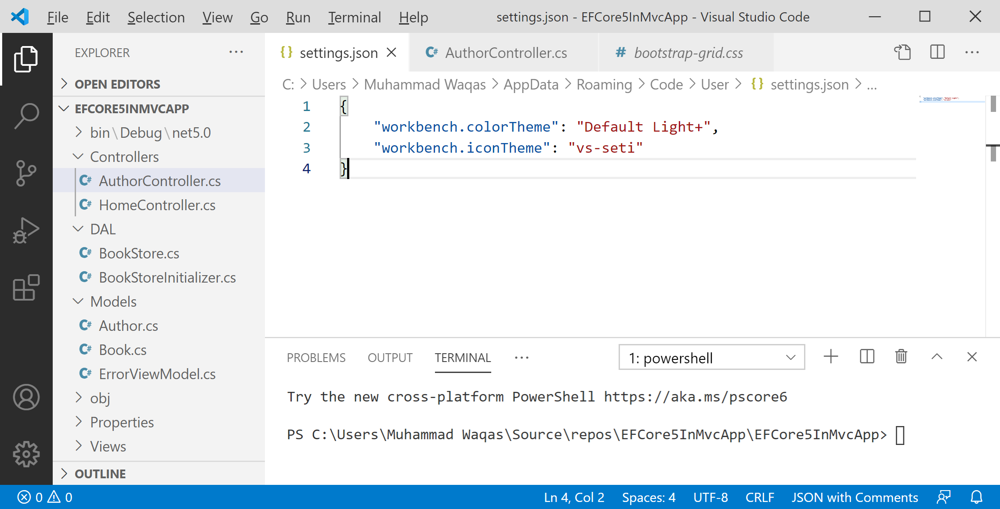
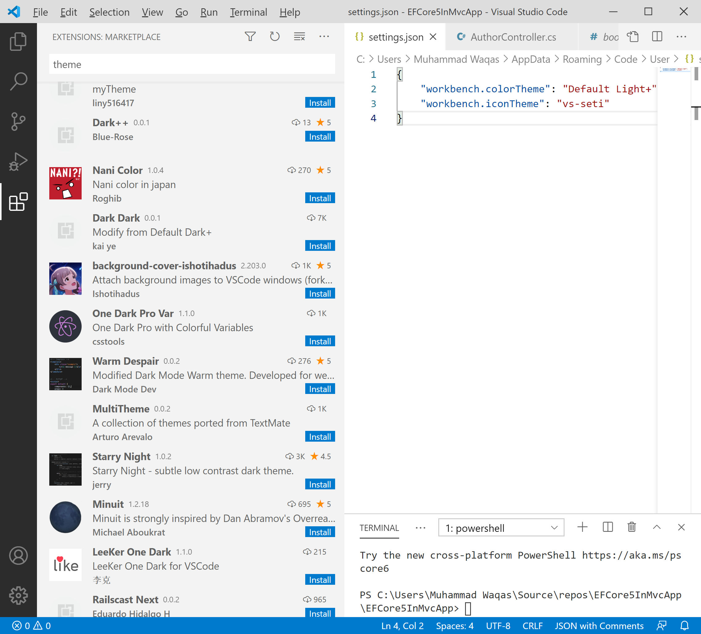
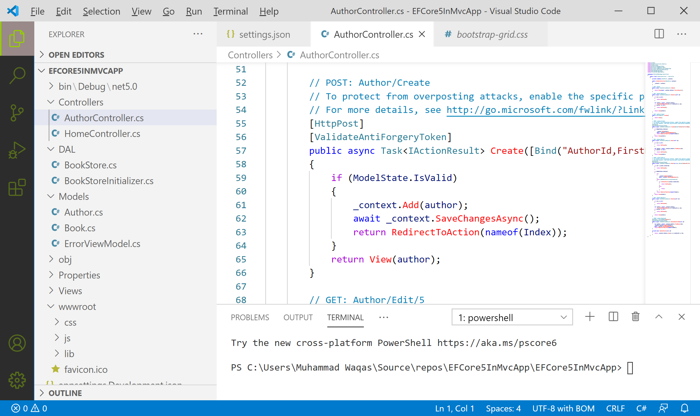

# Themes

Themes in Visual Studio Code let you modify the user interface colors to suit your preferences and work environment.



In Visual Studio Code, you can open the Color Theme picker with **File > Preferences > Color Theme**, or you can also use the keyboard shortcut `Ctrl+K Ctrl+T` to display the picker.

To preview the theme's colors, use the cursor keys, select the theme you want and press Enter.



The active color theme is stored in your user settings (`settings.json`).



## Install Color Themes from the Marketplace

On VS Code Extension Marketplace, you will a see the community uploaded alot of themes. If you find one you want to use, install it and restart VS Code, and the new theme will be available.

To search for themes, type 'theme' in the Extensions view (`Ctrl+Shift+X`) search box.



## Customizing a Color Theme

### Workbench Colors

You can customize your active color theme with the `workbench.colorCustomizations` and `editor.tokenColorCustomizations` user settings.

```csharp
{
    "workbench.colorTheme": "Default Light+",
    "workbench.iconTheme": "vs-seti",
    "workbench.colorCustomizations": {
        "activityBar.activeBackground": "#998989",
        "activityBar.border": "#025dc5",
        "activityBar.foreground": "#96cc03"
    },
    "editor.tokenColorCustomizations": {
        "comments": "#0086bb",
        "functions": "#FF0000"
      }
}
```

To set the colors of VS Code UI elements such as list & trees (File Explorer, suggestions widget), diff editor, Activity Bar, notifications, scroll bar, split view, buttons, and more, use workbench.colorCustomizations.


