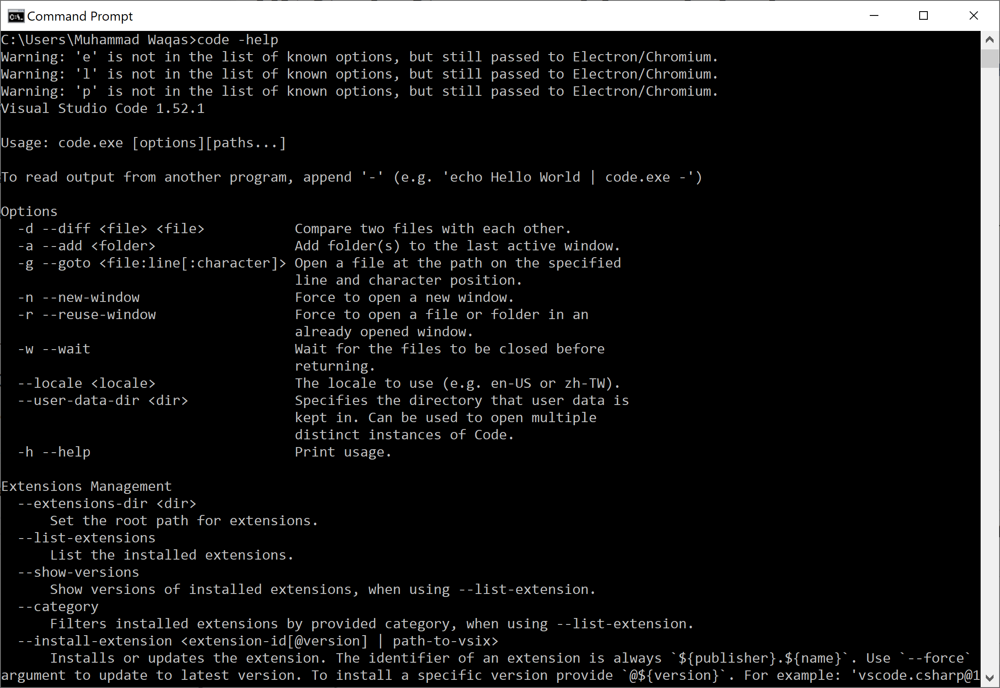
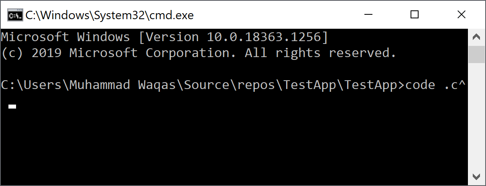
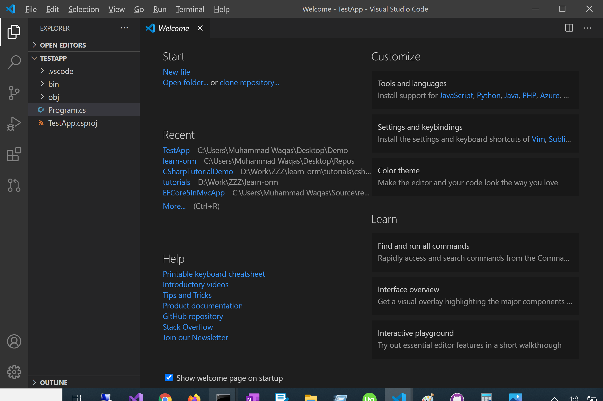
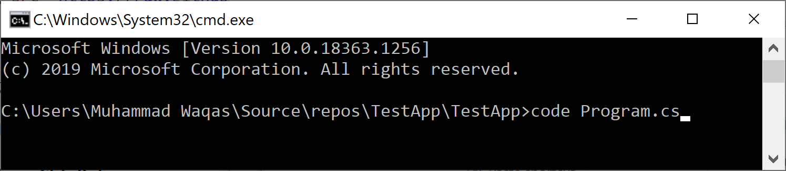
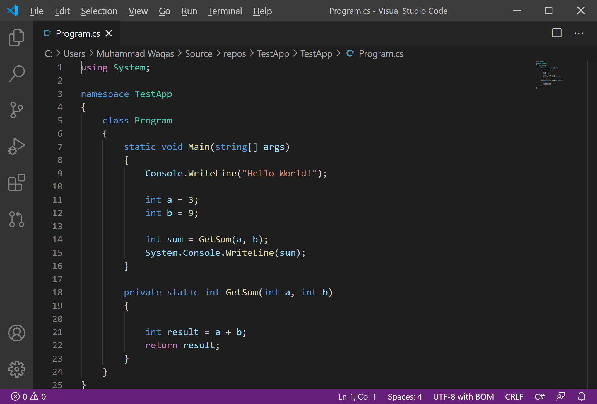

# VS Code Command Line Interface

Visual Studio Code has a powerful command-line interface built-in that lets you control how you launch the editor. You can open files, install extensions, change the display language, and output diagnostics through command-line options.

## Command Line Help

To get an overview of the VS Code command-line interface, open a terminal or command prompt and type code `--help`. 

You will see the version, usage example, and list of command-line options.

## Launching from Command Line

You can launch the VS Code from the command line to quickly open a file, folder, or project. Open terminal or command prompt, navigate to your project folder, and type `code .`

You see that the folder is open the Visual Studio Code.

Windows and Linux installations should add the VS Code binaries location to your system path. If this isn't the case, you can manually add the location to the `Path` environment variable. 

## Core CLI Options

Here are optional arguments you can use when starting VS Code at the command line via code:

| Argument           | Description                                                            |
| :------------------| :----------------------------------------------------------------------|
| `-h` or `--help`  | Print usage                                                            |
| `-v` or `--version`      | Print VS Code version (for example, 1.22.2), GitHub commit id, and architecture (for example, x64). |
| `-n` or `--new-window`   | Opens a new session of the VS Code instead of restoring the previous session (default). |
| `-r` or `--reuse-window` | Forces opening a file or folder in the last active window. |
| `-g` or `--goto`          | When used with `file:line[:character]`, opens a file at a specific line and optional character position. This argument is provided since some operating systems permit: in a file name. |
| `-d` or `--diff`          | Open a file difference editor. Requires two file paths as arguments. |
| `-w` or `--wait`          | Wait for the files to be closed before returning. |
| `--locale <locale>`      | Set the display language (locale) for the VS Code session. (for example, en-US or zh-TW)| 

## Opening Files and Folders

To open a file, you can open it by using the `code <file name>` command.

Now you can see that the specified file is open in the editor.

If the specified file does not exist, VS Code will create them for you along with any new intermediate folders.

 - For both files and folders, you can use absolute or relative paths. 
 - Relative paths are relative to the current directory of the command prompt where you run code.

## Working with Extensions

You can install and manage VS Code extensions from the command line.

| Argument           | Description                                                            |
| :------------------| :----------------------------------------------------------------------|
| `--install-extension <ext>` | Install an extension. Provide the full extension name publisher.extension as an argument. Use --force argument to avoid prompts.|
| `--uninstall-extension <ext>` | Uninstall an extension. Provide the full extension name publisher.extension as an argument.|
| `--disable-extensions`         |Disable all installed extensions. Extensions will still be visible in the Disabled section of the Extensions view but they will never be activated.|
| `--list-extensions`            | List the installed extensions.|
| `--show-versions`              |Show versions of installed extensions, when using `--list-extensions` |
| `--enable-proposed-api <ext>` | Enables proposed api features for an extension. Provide the full extension name publisher.extension as an argument.|

