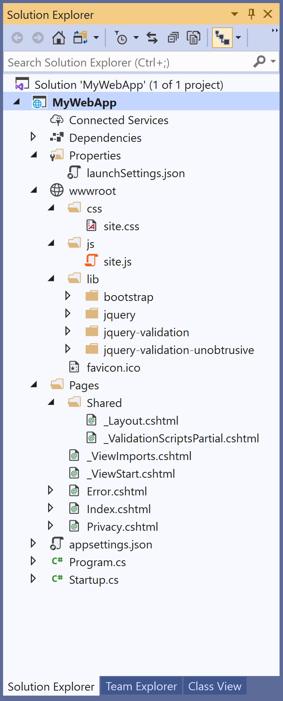
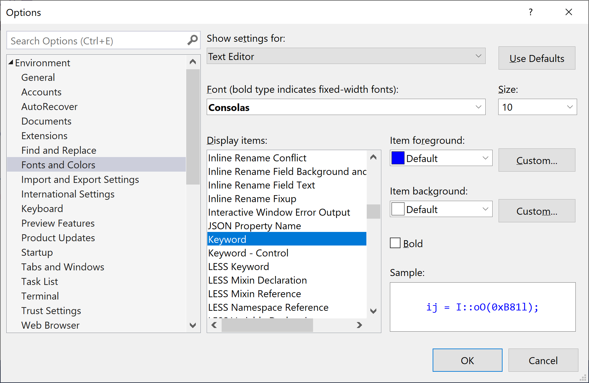
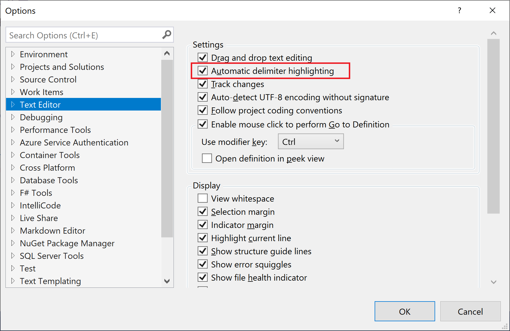
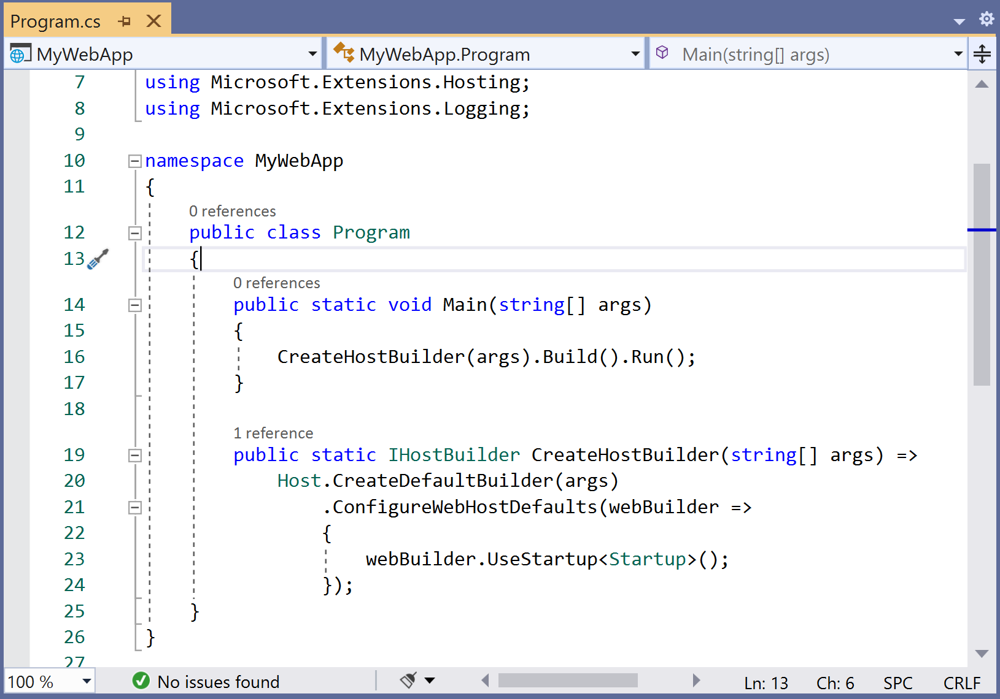
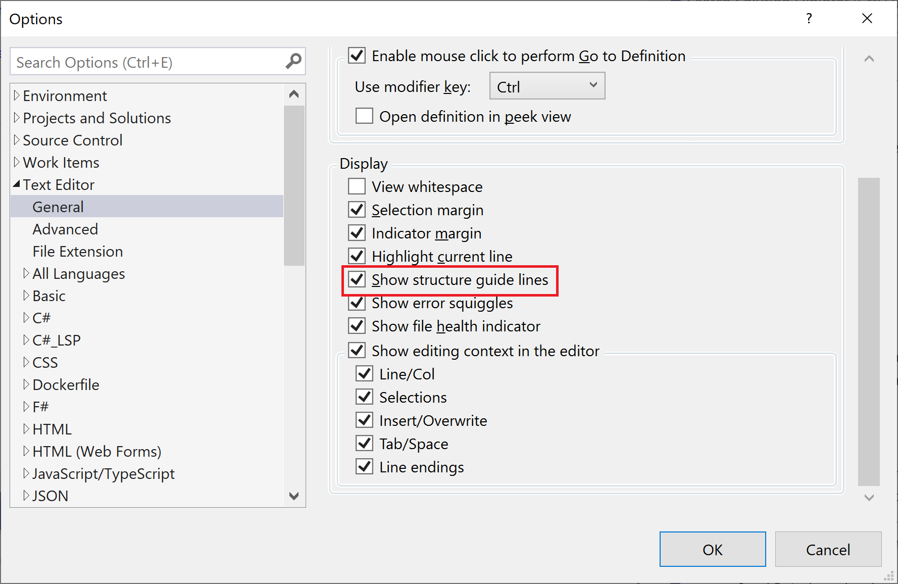
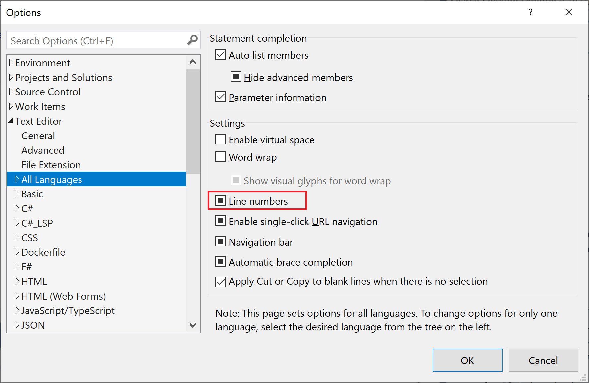
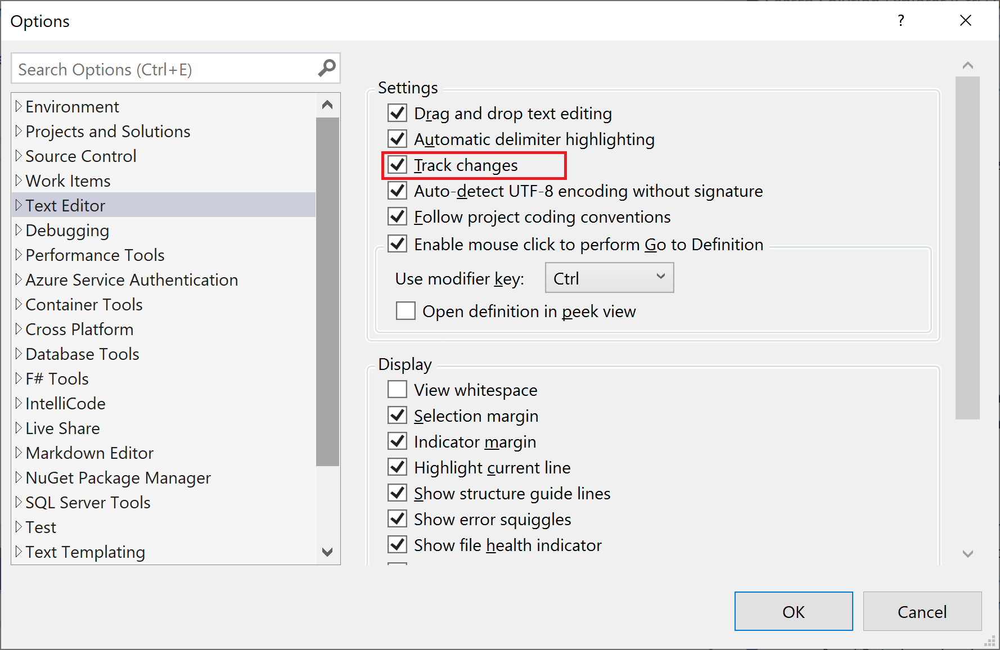
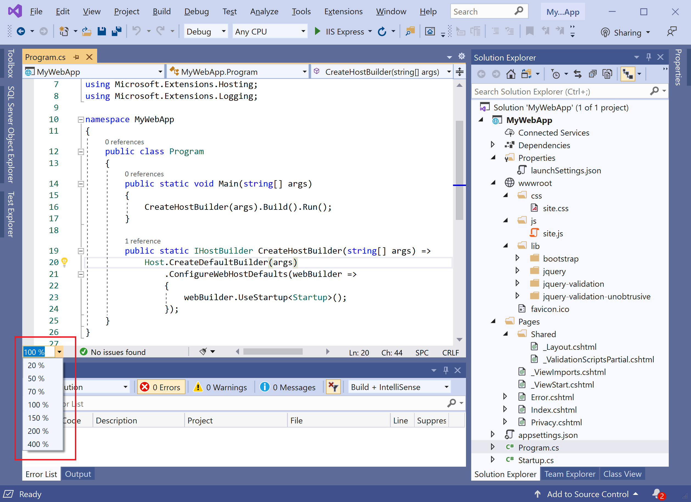

# Code Editor

The Visual Studio editor provides many features that make it easier for you to write and manage your code and text. You can expand and collapse different blocks of code by using outlining. You can view your code in a number of different ways. 

By default, **Solution Explorer** shows your code organized by files. 

You can click on the **Class View** tab at the bottom of the window to view your code organized by classes.

The following are the most commonly used editor features.

## Syntax Coloring	

In Visual Studio, some syntax elements of code and markup files are colored differently to distinguish them. 

 - For example, keywords such as `using` in C# and `Imports` in Visual Basic are one color, but types such as `Console` and `Uri` are another color. 
 - Other syntax elements are also colorized, such as string literals and comments. 
 - C++ uses color to differentiate among types, enumerations, and macros, among other tokens.

You can see the default color for each type, and you can change the color for any specific syntax element by clicking **Tools > Options**, and then selecting **Environment > Fonts and Colors**.

## Error and Warning Marks

When you write code and build your solution, you may see different-colored wavy underlines also known as squiggles or light bulbs appearing in your code.

 - Red squiggles denote syntax errors, blue denotes compiler errors, green denotes warnings, and purple denotes other types of errors. 
 - Quick Actions suggest fixes for problems and make it easy to apply the fix.

## Brace Matching

When the insertion point is placed on an open brace in a code file, both the open and closing braces are highlighted. 

 - It gives you immediate feedback on misplaced or missing braces. 
 - You can turn brace matching on or off with the **Automatic delimiter highlighting** option on **Tools > Options > Text Editor**

## Structure Visualizer	

The dotted lines connect matching braces in code files, making it easier to see the opening and closing brace pairs. 

You can turn these lines on or off with the **Show structure guide lines** option on the **Tools > Options > Text Editor > General** page.

## Line Numbers	

Line numbers can be displayed in the left margin of the code window. They are not displayed by default. You can turn this option on **Tools > Options > Text Editor > All Languages**.

## Change Tracking

The color of the left margin allows you to keep track of the changes you have made in a file. 

 - Changes you have made since the file was opened but not saved are denoted by a yellow bar on the left margin also known as the selection margin. 
 - After you saved the changes before closing the file, the bar turns green. 
 - If you undo a change after you have saved the file, the bar turns orange. 

To turn this feature on or off, change the Track changes option on **Tools > Options > Text Editor**.

 

## Selecting Code and Text

You can select text either in the standard continuous stream mode or in the box mode, in which you select a rectangular portion of text instead of a set of lines. 

 - To make a selection in box mode, press **Alt** as you drag the mouse over the selection or press **Alt+Shift+<arrow key>**. 
 - The selection includes all of the characters within the rectangle defined by the first character and the last character in the selection. 
 - Anything typed or pasted into the selected area is inserted at the same point on each line.

## Zoom

You can zoom in or out in any code window by pressing and holding the **Ctrl** key and moving the scroll wheel on the mouse. You can also use the Zoom box in the lower-left corner of the code window to set a specific zoom percentage. 

 

## Navigate and Find Code

You can move around in the code editor in several different ways. 

Including navigating backward and forward to previous insertion points. 

 

Viewing the definition of a type or member, and jumping to a specific method using the navigation bar. We will discuss it further in the [Code Navigation](code-navigation.md) article.

