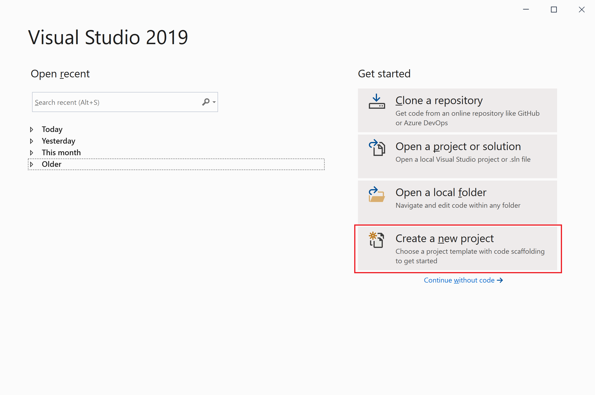
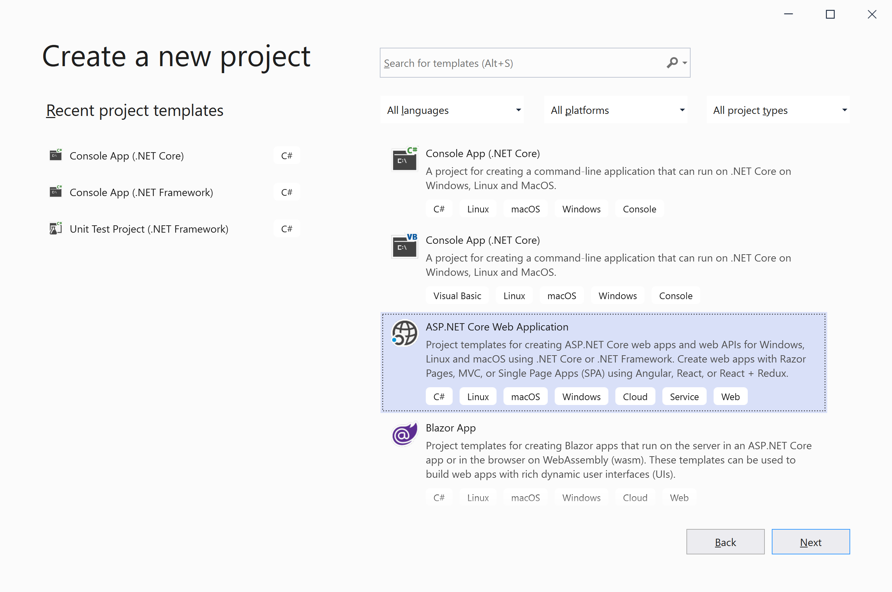
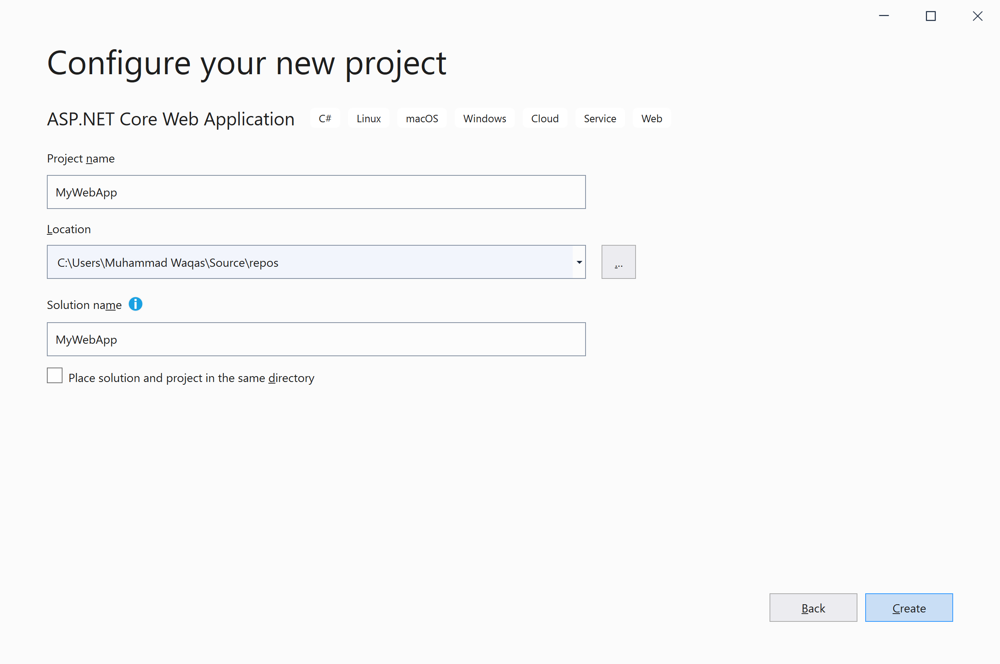
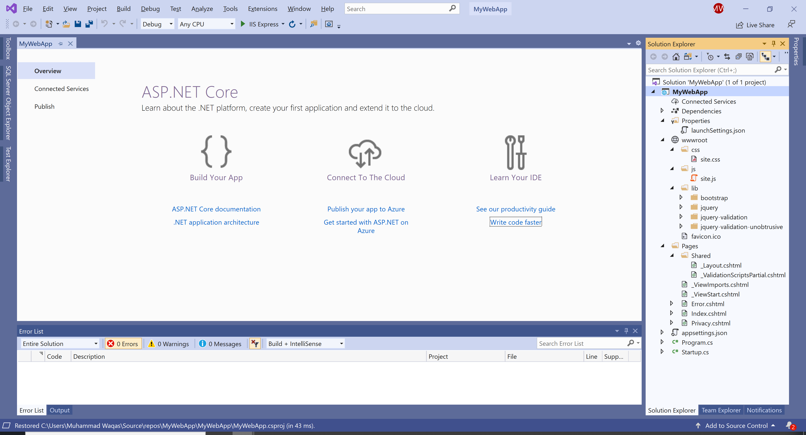
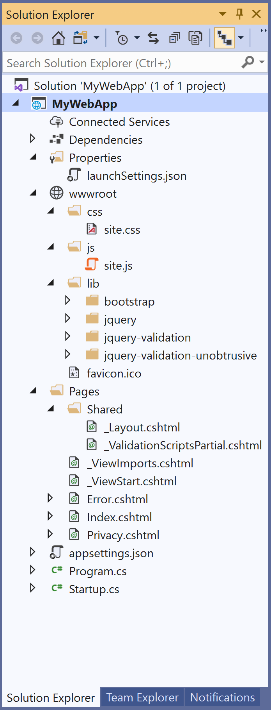

# Create Solution and Project

In Visual Studio, a project holds the items needed to build your application, such as source files, images, icons, references, etc. When you create a new project, Visual Studio creates a solution to contain the project. You can also add new or existing projects to the solution.

## What is a Project?

When you create an application or website in Visual Studio, you start with a project. A project contains all files that are compiled into an executable, library, or website. 

 - Those files can include source code, icons, images, data files, and so on. 
 - A project also contains compiler settings and other configuration files that might be needed by various services or components that your program communicates with.

## What is a Solution?

A Solution is simply a container for one or more related projects, along with build information, Visual Studio window settings, and any miscellaneous files that aren't associated with a particular project. 

 - A project is contained within a solution. 
 - It is described by a text file (`.sln`) with its own unique format, it is not intended to be edited by hand.

Visual Studio uses two file types (`.sln` and `.suo`) to store settings for solutions:

| Extension | Name                     | Description                                                                     |
|:----------|:-------------------------|:--------------------------------------------------------------------------------|
| .sln      | Visual Studio Solution   | Organizes projects, project items, and solution items in the solution.          |
| .suo      | Solution User Options    | Stores user-level settings and customizations, such as breakpoints.             |

## Create a New Project

There are multiple ways to create a new project in Visual Studio 2019. When you first open Visual Studio, the start window appears, and from there, you can choose **Create a new project**.

Select the **Create a new project** option.

In the template pane, select **ASP.NET Core Web Application** and click the **Next** button.

Enter the project name, you can change the location and solution name, but we will leave it as is and click on the **Create** button.  

Select the **Web Application** template and click on the **Create** button. You can see a new web application project is created.

When you create a new project, it is saved by default at `%USERPROFILE%\source\repos`. You can change this location in the Projects location setting under **Tools > Options > Projects and Solutions > Locations**.

## Solution Explorer

When a new project is created, you can use **Solution Explorer** to view and manage the projects and a solution and their associated items. 

You can see that a solution is created which contains one project and both a solution and project have the same name. You can choose a different name for a solution on the **Configure your new project** page.

 - A project contains multiple files, folders, and references. 
 - Creating a new project from a template gives you a project with the essentials for that project type. 
 - You can rename the files or add new or existing code and other resources to it as needed.

