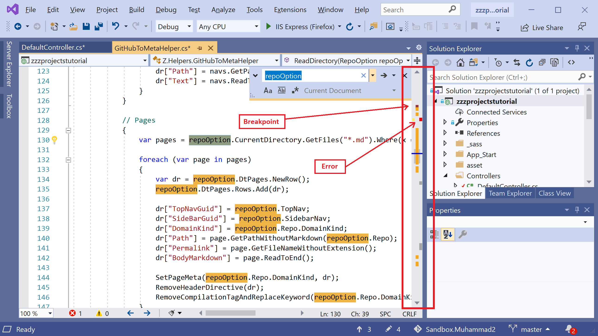
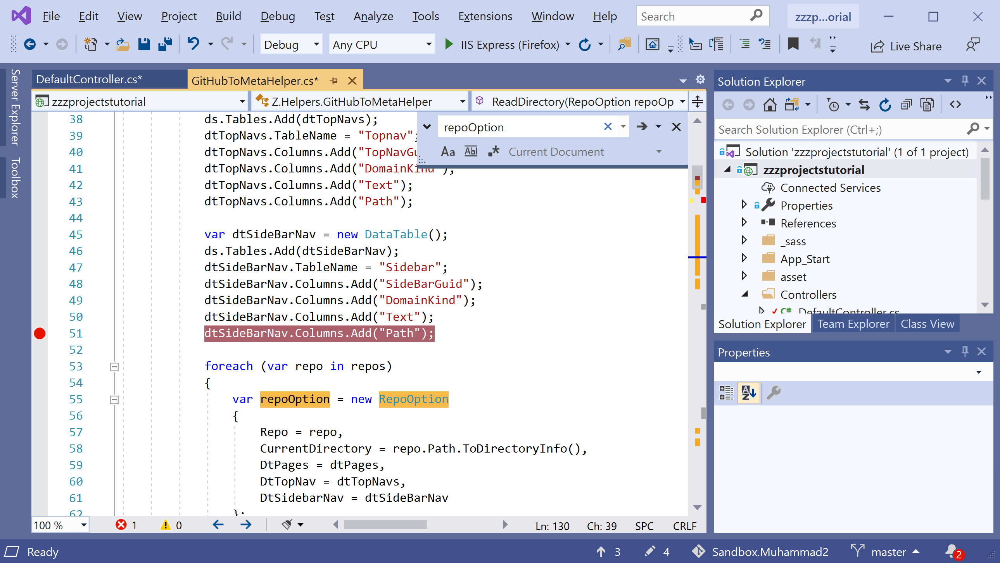
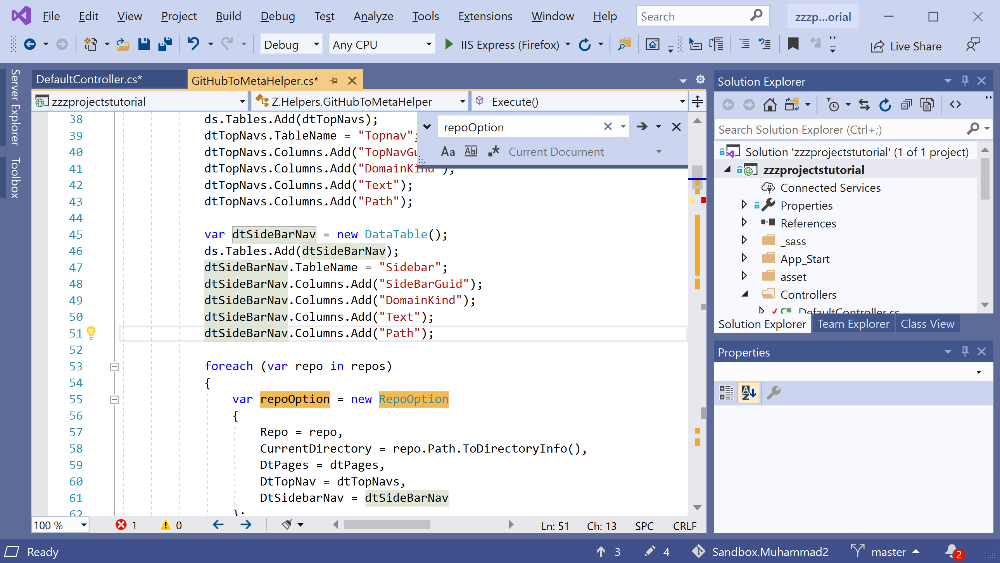
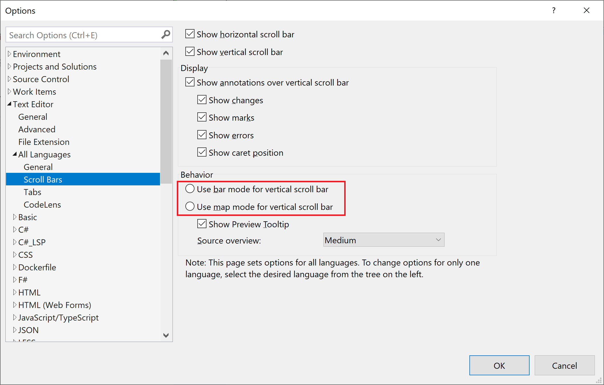
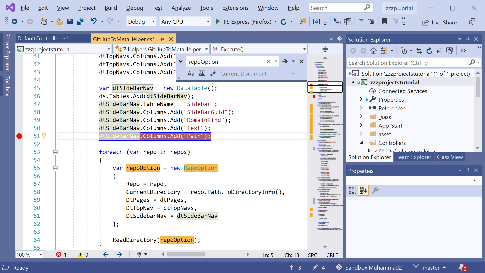
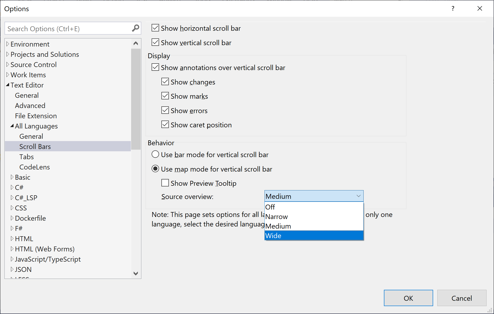
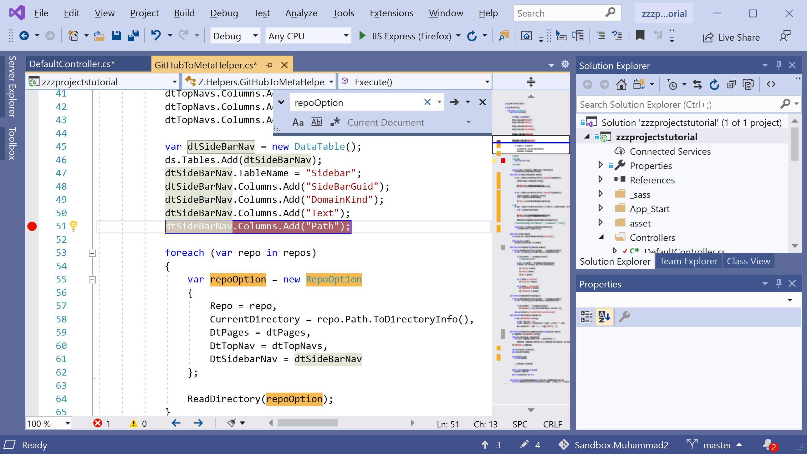
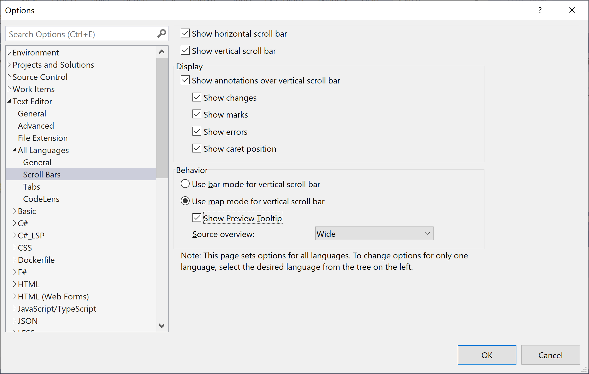

# Customize Scroll Bar

In Visual Studio, most of the time you will be working with long code files and you will notice that it is very hard to keep track of where everything is in the file. 

 - You can customize the scroll bar of the code editor to give you an overall picture of what's happening in your code.
 - You can select whether the scroll bar shows annotations such as code changes, breakpoints, bookmarks, errors, and caret position.

To open the **Scroll Bars** options, select the the **Tools > Options > Text Editor > All Languages > Scroll Bars** menu.

Let's try to open a large code file and add a breakpoint, and error to your code. 

The scroll bar shows you the effect of the breakpoint and error. Now if you click on the scroll bar, it will page up or down bases on the location where you are clicking.

Now let's disable the breakpoint and you will see the effect on the scroll bar as well.

## Modes

The scroll bar has two modes.

### Bar mode

In the Bar mode, you will see annotation indicators on the scroll bar. 

When you click on the scroll bar, it will only page up or down but does not jump to that location in the file.

### Map mode

In the Map mode, you will see annotation indicators as well as lines of code in miniature on the scroll bar. 

When you click a location on the scroll bar, the cursor jumps to that location in the file instead of just scrolling up or down a page.

You can choose how wide the map column is by selecting a value in the **Source overview** drop-down list. 

Let's select the **Wide** option from the drop-down list and you will see the wider scroll bar.

To enable a larger preview of the code when you rest the pointer on the map, select the **Show Preview Tooltip** option. 

Let's hover the mouse pointer on the scroll bar and you will see a preview of the code.

