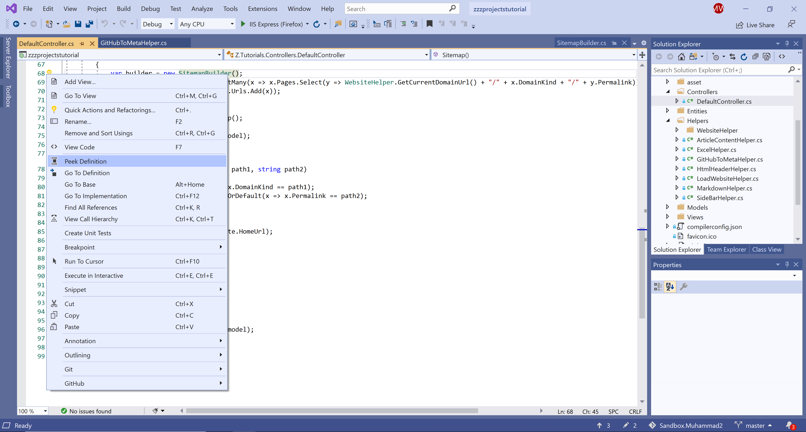
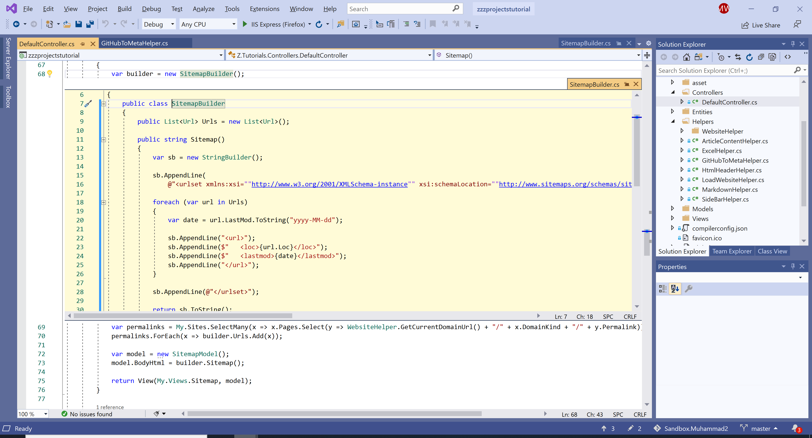
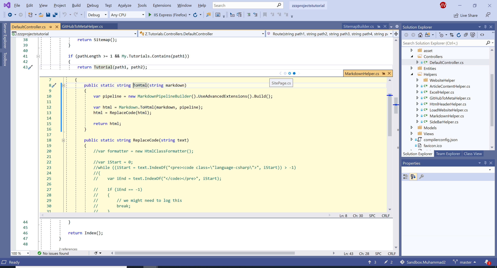
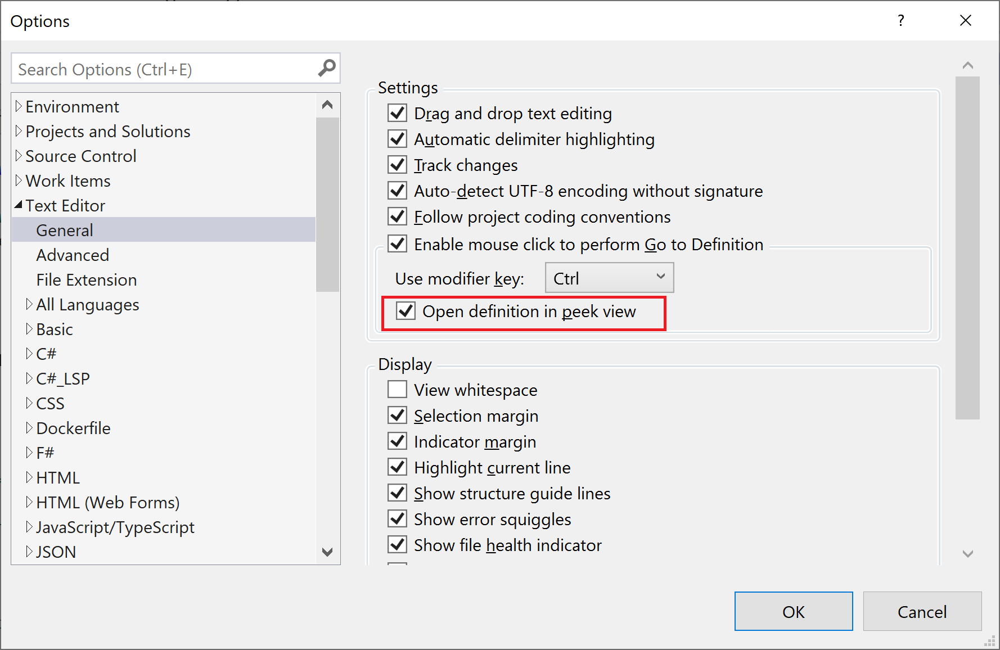

# Peek Definition

The **Peek Definition** displays the definition of the selected element in a window without navigating away from your current location in the code editor. It lets you preview the definition of a type without leaving your current location.

 - Using Keyboard, place your cursor on the member name and press **Alt + F12**. 
 - Using the mouse, right-click on the member name and select **Peek Definition** from the menu. 

The **Peek Definition** and **Go To Definition** are almost similar, the only difference is that **Peek Definition** shows the information in a pop-up window, and **Go To Definition** shows the information in a separate code window.

 - The drawback of the **Go To Definition** is that it causes your context to switch to the definition code window. 
 - But with the **Peek Definition**, you can view and edit the definition and move around inside the definition file while keeping your place in the original code file.

Let's right-click on the member name and choosing **Peek Definition** from the right-click menu. 

You will see that the member definition is opened up in the popup window.

The definition window appears below the line that contains the member in the original file. The window doesn't hide any of the code in your original file. 

 - You can move the cursor to different locations in the peek definition window. 
 - You can also still move around in the opening code window.
 - You can close the definition window by choosing the **Esc** key or the Close (`X`) button on the definition window tab.

## Nested Peek Definition Windows

You can open another **Peek Definition** window inside an already open **Peek Definition** window. A set of breadcrumb dots appears next to the definition window tab, which you can use to navigate between definition windows. 

The tooltip on each dot shows the file name that the dot represents.

The **CTRL + Click** will run the **Go To Definition** command, but you can make it open a **Peek Definition** window by changing an option on **Tools > Options > Text Editor > General**.

Check the option **Open definition in peek view**  and click **OK** button. Press **Ctrl** and click the member, you will see the **Peek Definition** window instead of **Go To Definition**.
