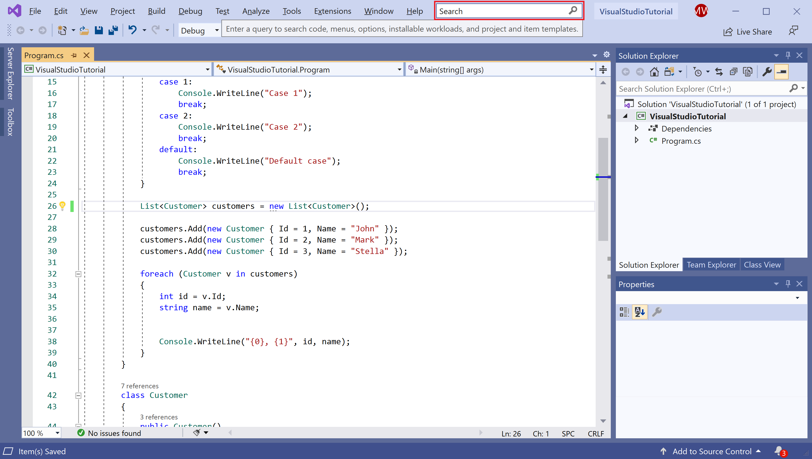
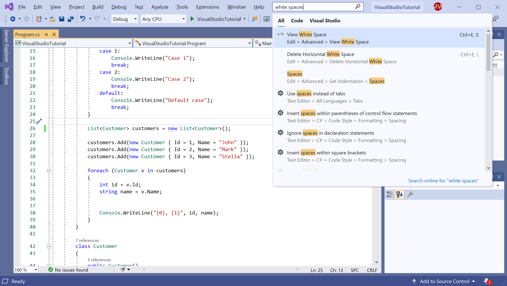
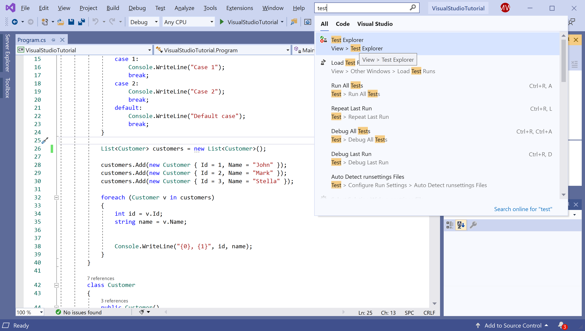
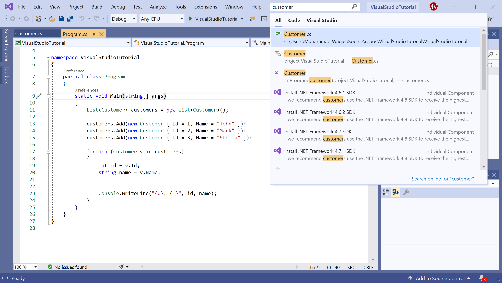

# Visual Studio Search

In Visual Studio, you will see a lot of menus, options, and features, which can be difficult to remember. 

 - The search feature in Visual Studio helps developers find IDE menus and options, while also searching your code. 
 - It offers a quick way to search across IDE features and your code.
 - The search bar on the IDE is now accessible with a quick Ctrl+Q shortcut, and once you access the search bar you will now get search results for shortcuts, commands, settings, etc.

The search in Visual Studio is unlike other search features such as **Find in Files** or **Search Solution Explorer**, it includes IDE features, menu options, file names, and more. 

## Search Settings or Options

You can use the Visual Studio search box to find settings, options, and similar configuration items. For example, search for "white spaces" to quickly find and open the dialog that allows you to view the white spaces.

The search results also show the location where you can find this option or command. Let's click on the first result from the list and you will see the change in the editor.

## Search a Window or Panel

you can search for windows or panels that you may have accidentally closed. For example, search for the "test" to find and open the Test Explorer window:

## Search Files and Code

In Visual Studio search, you can also search for your source files, code, class, property, method, etc. 

We have entered "customer" in the search box and you can see that it has found the `Customer.cs` file and the `Customer` class in the Solution.

In most cases, the Visual Studio search will also remind you of the menu, shortcut keys, and location of each item in the results.
